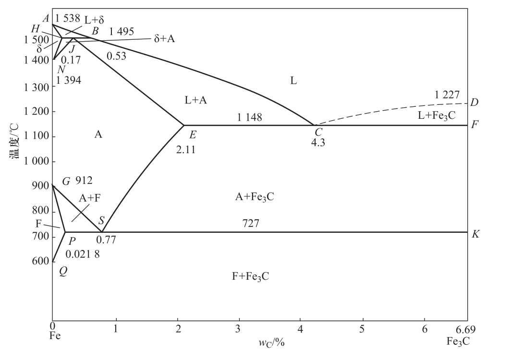
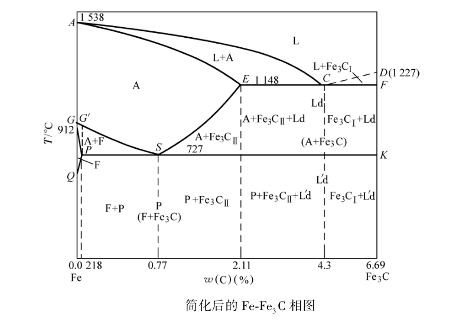
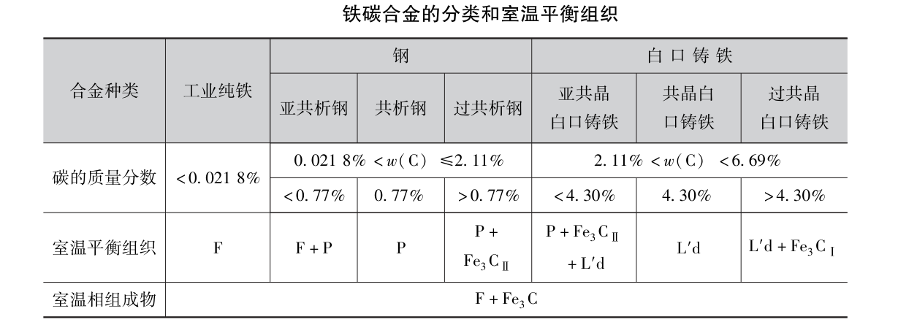
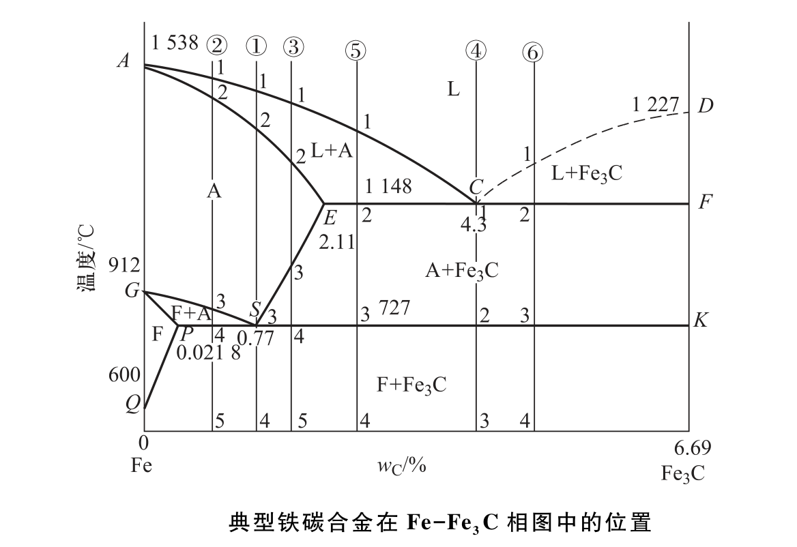

# 钢的热处理

## 文章简介

## 前奏

### 铁碳合金相图

**附图** 

先附图一张，此图为Fe-Fe3C合金相图。

##### 名词解释

首先先做一下名词解释，了解铁碳合金相图中相是什么意思，固溶体是什么意思。

**相：** 合金中的相是指有相同的结构、 物理性能和化学性能， 并与该系统中其余部分有明显界面分开的均匀部分。（官方解释是这样的，多思考感受一下可能就会理解了）

**固溶体：** 固态下合金中的组元间相互溶解形成的均匀相称为固溶体。 在固溶体中晶格保持不变的组元称为溶剂， 因此固溶体的晶格与溶剂的晶格相同。（现在不明白不要紧，看我下面解释铁素体（F）和奥氏体（F）的内容，你可以感受一下什么是固溶体）

**L：** 请看上图，表示液态的铁，在L区域为液态的铁碳合金。

**A：** 表示奥氏体，奥氏体有时也用**γ**，**γ-Fe**表示，在A区域为奥氏体区。

**F：** 表示铁素体，铁素体有时也用**α**，**α-Fe**表示，在F区域为铁素体区。

##### 关于此图

横坐标为含碳量，纵坐标为温度。还有一些点的含碳量，比如说P点，含碳量为0.0218%；S点，含碳量为0.77%；E点，含碳量为2.11%；C点，含碳量为4.3%；D，F，K点，含碳量为6.69%；J点，含碳量为0.17%等等等。还有就是有一些区域，最上面的L区，液相区；NJESG区，奥氏体区；GPQ区铁素体区；GSP区，奥氏体+铁素体区；CDF区，液相区+渗碳体区，等等等。

#### 铁碳合金的基本组织

铁碳合金有五中基本组织，分别是铁素体（F）、奥氏体（A），渗碳体（Fe3C）、珠光体（P）和莱氏体（Ld）。其中，铁素体和奥氏体是固溶体；渗碳体是金属化合物；珠光体和莱氏体是机械混合物。下面来介绍它们。

#### 铁素体（F）和奥氏体（A）

据我所知，铁碳合金相图中有两种固溶体，分别为铁素体（F）和奥氏体（A）。高中化学中讲过一个东西，晶格，你可以回忆一下。下面我先介绍两种晶格类型，体心立方晶格（bcc）和面心立方晶格（fcc）。有的元素在结晶后，它的晶体结构不再变化。但是铁这种元素在结晶后，它随着温度不断变化，然后它的晶体类型也会发生改变（同素异构转变）。

100%的液态纯铁不断冷却，在 1538℃时结晶（结晶完成后为固态）成为具有体心立方晶格的**δ-Fe**；温度继续冷却到 1394℃时，发生同素异构转变，体心立方晶格的**δ-Fe**转变为面心立方晶格的**γ-Fe**；温度继续冷却到912℃时，发生同素异构转变，面心立方晶格的**γ-Fe**转变为体立方晶格的**α-Fe**，再继续冷却，晶格类型不再发生变化。这种转变不仅体现在温度降低过程中，在加热过程中，随温度的升高，这些同素异构转变均能发生逆转变。总体转变过程如下图：

 **注：** 上面提到的同素异构转变为含碳量为0时的转变，根据上面的铁碳合金相图，我怀疑当有C存在时，同素异构转变的温度可能会不同。比如 ，你看AB线和AH线，且只看H点左侧，AB线和AH线是斜的，说明它的含碳量不同，在含碳量为0（A点）的时候，L相（液态的铁）直接完全结晶出δ-Fe；在H点左侧，即含碳量在0-H点之间时，随着含碳量改变L相和δ-Fe也会相互转换，但是没有完全转换，你看ABH区域，L相和δ-Fe是共存的。[HJB线发生的反应及转化，后边再讲（包晶反应）] [算了，没找到资料，先不讲了]

你看HN线和JN线，且只看J点左侧，HN线和JN线是斜的，说明它的含碳量不同，在含碳量为0（N点）的时候δ-Fe和γ-Fe直接相互转换，在J点左侧，即含碳量在0-J点之间时，随着含碳量改变δ-Fe和γ-Fe也会相互转换，但是没有完全转换，你看HJN区域，γ-Fe和δ-Fe是共存的。

你看GS线和GP线，且只看P点左侧，GS线和GP线是斜的，说明它的含碳量不同，在含碳量为0（G点）的时候γ-Fe和α-Fe直接相互转换，在P点左侧，即含碳量在0-P点之间时，随着含碳量改变γ-Fe和α-Fe也会相互转换，但是没有完全转换，你看GSP区域，γ-Fe和α-Fe是共存的。[PSK线发生的反应及转换，后面再讲（共析反应）]

再说回铁素体（F）和奥氏体（A）。铁在冷却的过程中，碳溶于**γ**铁形成的固溶体称为奥氏体，用符号 **A**或**γ**表示。碳溶于**α**铁形成的固溶体称为铁素体，用符号**F**或**α**表示。简单来说就是有C跑到了**γ-Fe**和**α-Fe**的晶格中，形成了奥氏体（A）和铁素体（F）固溶体。

高中时我们还学过，不同晶格结构，它们的原子排列的紧密程度是不一样的。总结下来就是，体心立方晶格的原子致密度为 0. 68，面心立方晶格的原子致密度为 0. 74。致密度不一样，他们溶解C的能力就不一样，且**γ-Fe**的溶碳能力强，**α-Fe**的溶碳能力弱。这是导致奥氏体和铁素体的性能不一样的原因之一。

现在可以简单看一下上面的铁碳合金相图，AHN区域为**δ**铁，NJESG区域为奥氏体区，GPQ为铁素体区。

兄弟，我有一个疑问，碳溶于**γ**铁形成的固溶体称为奥氏体，碳溶于**α**铁形成的固溶体称为铁素体。那么，碳能不能溶于**δ**铁，碳溶于**δ**铁形成的固溶体是什么体？

#### 渗碳体（Fe3C）

渗碳体是铁和碳的金属化合物，渗碳体中碳的质量分数 w（C）= 6. 69%，熔点为1227℃。

#### 珠光体（P）

珠光体是由铁素体和渗碳体组成的**机械混合物**， 用符号 P 表示。 珠光体中碳的质量分数 w（C） = 0. 77% 。

#### 莱氏体（Ld）

莱氏体是由奥氏体和渗碳体组成的**机械混合物**， 用符号 Ld 表示。 莱氏体中碳的质量分数 w（C） = 4. 3% 。它是一种高温组织， 存在温度为 727～1148℃。当温度降至 727℃以下时， 莱氏体中的奥氏体将转变为珠光体， 此时组织称为低温莱氏体， 用符号 L′d 表示。

### 铁碳合金相图分析

再次附上铁碳合金相图：

关于铁碳合金相图，首先要明白一点，铁碳合金相图是指在平衡**（极其缓慢加热或冷却）** 条件下，不同成分的铁碳合金在不同温度所处状态或组织的图形。

**注：** 为什么要强调**极其缓慢冷却或加热**，原因是有一次我看完铁碳合金相图后，发现既然冷却或加热到不同温度，会产生不同的相，在相图中，只要是在那个区域，他的相不是不变的吗？比如说在w(C)=0.77%时的共析钢，不同速度冷却难道还能形成其他的相吗，或是形成其他的东西？冷却后，为什么有什么随炉冷却，空气中冷却，油冷，水冷等（一些热处理中），搞一些不同冷却速度，来冷却合金是做什么的？我虽然也隐约感受到，冷却速度不同，会影响到合金中相的行成，但是我所查阅的书中却没有提到**极其缓慢**，我就有点纠结。（本人似有强迫症，不找到对应资料，就浑身难受，根本就不想再往下学下去了）。后来我就在网络中查找资料，终于找到了这句话：*铁碳合金相图是指在平衡**（极其缓慢加热或冷却）** 条件下，不同成分的铁碳合金在不同温度所处状态或组织的图形*。不同的冷却速度确实会影响铁碳合金中的组织，感觉身体瞬间轻松了不少。

#### 三条水平线

朋友们，你们好，我又找了一张铁碳合金相图，如下图（这是一张简化后的铁碳合金相图，因为坐上角的包晶反应那一片区域用的少，所以简化了）：

在铁碳合金相图中有三水平线，一条包晶反应线、一条共晶反应线、一条共析反应线。

**HJB：** 包晶反应线；**ECF：** 共晶反应线；**PSK：** 共析反应线

**包晶反应：** 包晶反应是指由一种液相和一种固相生成一种新的固相的反应。（液体+固体->变出来其他东西）

**共晶反应：** 共晶反应是指在一定温度下，由一定成分的合金液相中同时结晶出两个固相并形成机械混合物的过程。（从一种液体中变出来其他两种固体）

**共析反应：** 共析反应是指在一定温度下， 由一定成分的固溶体中同时析出两种化学成分与结构完全不同的固相并形成机械混合物的转变过程。（从一种固体中变出来其他两种固体）

##### 包晶反应

包晶反应暂不讲解，因为本人非常不了解。......

##### 共晶反应

水平线ECF为共晶转变线（共晶线），铁碳合金的共晶反应是从L相中结晶的，只要含碳量大于2.11%，缓冷至1148℃（也就是在ECF这条共晶转变线上），均会发生共晶反应。看ECF这条线的上面，有三个区域L+A区域，L区域，L+渗碳体区域，他们都含有L相，所以，根据共晶反应，含碳量大于2.11%的液态铁碳合金在缓冷至1148℃的条件下，发生了反应，生成了莱氏体（Ld）（奥氏体+渗碳体的机械混合物）。

##### 共析反应 

水平线PSK为共析反应线（共析线，有称为A3线），铁碳合金中的共析反应，缓冷时是从奥氏体析出的，只要含碳量大与0.0218%的铁碳合金，在缓冷至727℃（也就是在PSK这条共晶转变线上），均会发生共析转变（C点之后即含碳量大于4.3%之后，没有奥氏体相，我怀疑没有发生共析反应）。看PSK这条线的上面，从P点到C点之间，均有奥氏体，所以，根据共析反应，含碳量大于0.0218%的铁碳合金（奥氏体），在缓冷至727℃的条件下，发生了反应，生成了珠光体（P）（铁素体+渗碳体的混合物）。

#### 特征线

**ACD线（液相线）：** 温度在此线以上时，铁碳合金处于液态（L），合金缓冷至液相线时，开始结晶。 在冷至 AC 线时， 开始结晶出奥氏体；冷至 CD 线时，开始从液相中结晶出渗碳体，称为一次渗碳体 （Fe3CI）。

**AECF线（固相线）：** 铁碳合金在此温度线以下时， 已全部结晶为固相， 即冷却至此线时，结晶终了。

**ECF水平线（共晶线）：** 此时L、F、Fe3C三相共存

**PSK水平线（共析线）（A1线）：** 此时F、A、Fe3C三相共存

**GS线（A3线）：** 冷却时A相向F相转变的开始线，也是加热时F相向A相转变的终了线。

**ES线（Acm线）：** ES线是碳在A中的溶解度曲线，铁碳合金冷却时温度低于此线时，会从A相中析出二次渗碳体，ES线是二次渗碳体的开始析出线，也叫Acm线。

**PQ线：** PQ线是碳在F中的溶解度曲线，当F相从727℃冷却时，从F中会析出三次渗碳体，但其数量很少。

#### 渗碳体的产生

在上图铁碳合金相图中，渗碳体共有三次生成，一次共晶与一次共析（共五次）。

**一次渗碳体：** 从L相中结晶出来的渗碳体做一次渗碳体。你看CD线和CDF区域，在CD线以下会从L相中结晶出渗碳体，叫做一次渗碳体（Fe3CI）。

**二次渗碳体：** 从奥氏体中析出来的渗碳体叫做二次渗碳体。你看ES线和ES线以下区域，在ES线以下会从A中析出渗碳体，叫做二次渗碳体（Fe3CII）。我怀疑EC线下也有奥氏体，并从奥氏体中也会析出二次渗碳体。

**三次渗碳体：** 从铁素体中析出来的渗碳体叫做三次渗碳体。你看PQ线和PQ线以下区域，在PQ线以下会从F中析出渗碳体，叫做三次渗碳体（Fe3CIII）。

**一次共晶渗碳体：** 发生共晶反应时产生的渗碳体（有的书中有这种区分）。

**一次共析渗碳体：** 发生共析反应时产生的渗碳体（有的书中有这种区分）。

注：为什么要把渗碳体分这么多种，本人也不清楚，本人没有研究过。本人把它们列出来是应为在铁碳合金相图中，在有的区域是存在渗碳体的，他们是铁碳合金的一部分。

#### 铁碳合金分类及平衡组织

本人一直不明白什么是刚，什么是铁，后来，一直研究（有一段时间想搞一下铁碳合金相图），终于，不知道为什么，突然好像有点明白什么是刚什么是铁，即使是把上面的铁碳合金分类表放在眼前也不知道，就是一直看不懂，后来慢慢的就知道了，可能是功夫不负有心人吧。

你可以先看上面的铁碳合金相图的QFSK下面的区域，并且他们被虚线分成了5份，而且，这些虚线的位置是不是也有一定的说法？P点的那一列含碳量为0.0218%；S点的那一列含碳量为0.77%；E点的那一列含碳量为2.11%；C点的那一列含碳量为4.3%；K点的那一列含碳量为6.69%。不同的含碳量把室温下的铁碳合金分为了5个区域，这五个不同的区域是5种不同的分类（让我想起了铠甲勇士，炎龙铠甲合体......）。此外还有两个特殊的分类，就是C点（碳含量4.3%）和S点（碳含量0.77%）。他们两个单独成为一个分类的铁碳合金，含碳量为0.77%的铁碳合金叫共析钢，含碳量为4.3%的铁碳合金叫共晶白口铸（让我想起了帝皇铠甲和修罗铠甲）。

**共析钢与共晶白口铁**

C点和S点是比较特殊的。先看C点，C点的含碳量为4.3%，在共晶线上，碳含量小于4.3%时，液态的铁碳合金随着温度的降低，会先变出来奥氏体，然后L相再发生共晶反应变出来莱氏体；在共晶线上，碳含量大于4.3%时，液态的铁碳合金随着温度的降低，会先变出来渗碳体，然后L相再发生共晶反应变出来莱氏体；在C点，碳含量为4.3%，它不会变出来奥氏体，也不会变出来渗碳体，液态的L相，在缓冷时，当到达共晶线时，它直接发生共晶转变，生成莱氏体。再看S点，S点的含碳量为2.11%，在共析线上，碳含量小于2.11%，随着温度的降低奥氏体转变为铁素体，然后奥氏体再发生共析反应，生成珠光体；在共析线上，碳含量大于2.11%，随着温度的降低奥氏体会析出渗碳体，然后奥氏体再发生共析反应，生成珠光体；在S点，碳含量为2.11%，它不会转变为铁素体，也不会析出铁素体，当奥氏体缓冷时，到达共析线时，它直接发生共析反应，生成珠光体（P）。

P点也有一点特殊，P点为碳在**α⁃Fe**中的最大溶解度0.0218%（碳如果往α⁃Fe中跑α⁃Fe的量，碳最多只能进去0.0218%），当含碳量小与0.0218%时，此时铁碳合金叫工业纯铁（即熟铁），如表所示。

我说了这么多是做什么的呢，因为这3个点比较特殊，C点叫共晶点，S点叫共析点，P点（P点叫什么点？）。他们3个点将一个区域分成了五份，并且C点和S点含碳量的铁碳合金独自成为一个类型的分类，共析钢和共晶。

含碳量为0.77%的铁碳合金叫共析钢，含碳量为4.3%的铁碳合金叫共晶白口铁。

现在再看上面的表吧，工业纯铁，亚共析钢，共析钢，过共析钢，亚共晶白口铁，共晶白口铁，过共晶白口铁它们的含碳量不同，范围如上表所示。但是为什么这么分类呢，我猜测和他们形成过程及相的组成有关，铁有三种同素异构体，**α⁃Fe**缓冷至室温成为了纯铁；**γ-Fe**由于公晶反应成为了共析钢，它还把自己的共析反应点的含碳量当作界限，把自己的最大碳溶解度当做界线，还分出了亚共析钢和过共析钢；液态的纯铁把自己的共晶反应点当做界限，形成了亚共晶和过共晶白口铁。再看一下渗碳体（Fe3C），它也不简单，他说我只要6.69%的碳，再多我不要，多余的碳给Fe2C[w(C)=9.68%]和FeC[w(C)=17.65%]吧。

#### 典型合金平衡结晶过程及组织

请看此图，

##### 共析钢的结晶过程

共析钢的含碳量为0.77%，看①，在缓冷时，到达1点时，由液相开始变为L相+A相，此时是混合物，继续缓冷到达2点后，完全结晶为奥氏体，继续缓冷，在到达共析线时（S共析点），此时它直接从A区域（即纯奥氏体中)在727℃时发生共析反应，生成珠光体，继续缓冷，基本不发生变化。（我说直接是什么意思呢？你看GSP区域，当含碳量小于0.77%时，它有F相+A相；你再看ES线下，当含碳量大于0.77%时，它有奥氏体和渗碳体；你再看①那一列，它没有再经过其它体，它直接发生了共析反应。）所以，共析钢的室温组织为珠光体。

##### 亚共析钢的结晶过程

亚共析钢的含碳量为0.0218%-0.77%，看②，在缓冷时，由液相开始变为L相+A相，此时是混合物，继续缓冷到达2点后，完全结晶为奥氏体，继续缓冷，仍旧为奥氏体，继续缓冷，开始由为奥氏体转变为铁素体，3-4区间内为奥氏体相+铁素体相，在由奥氏体变为铁素体的过程中，会有多余的碳往奥氏体中跑（因为铁素体需要的碳较少）使奥氏体的碳含量沿GS线增加，继续缓冷，到达727℃，里面的奥氏体开始发生共析反应，生成珠光体。此过程中的铁素体保留在基体中。所以4点以后，无明显组织变化，亚共析钢的室温组织为铁素体+珠光体。

##### 过共析钢的结晶过程

亚共析钢的含碳量为0.77%-2.11%，看③

##### 共晶白口铁的结晶过程

##### 亚共晶白口铁的结晶过程

##### 过共晶白口铁的结晶过程

