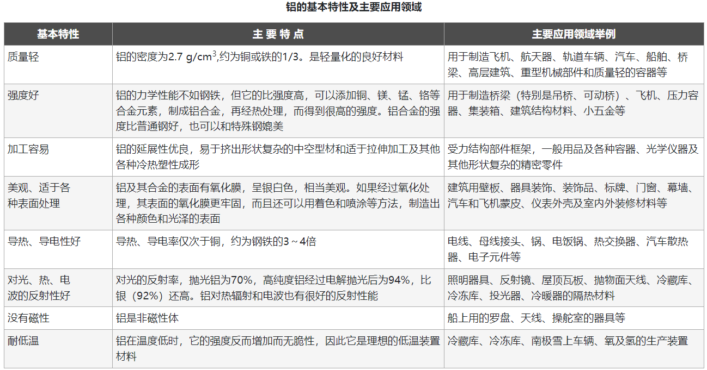
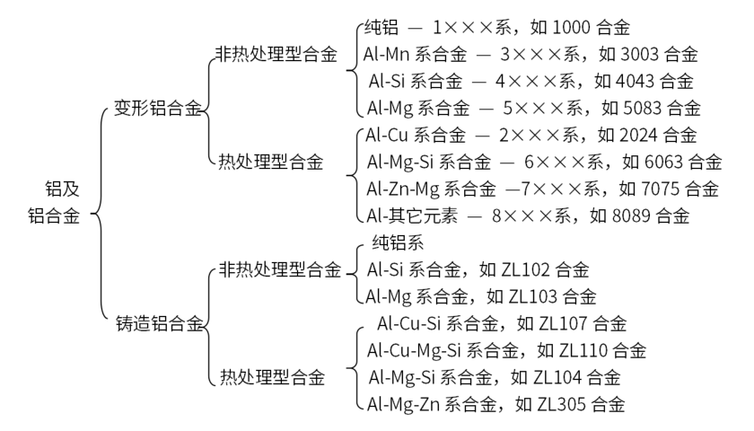
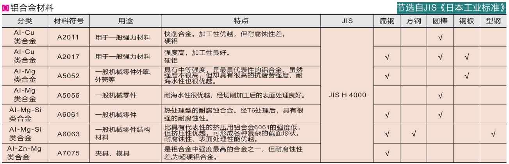
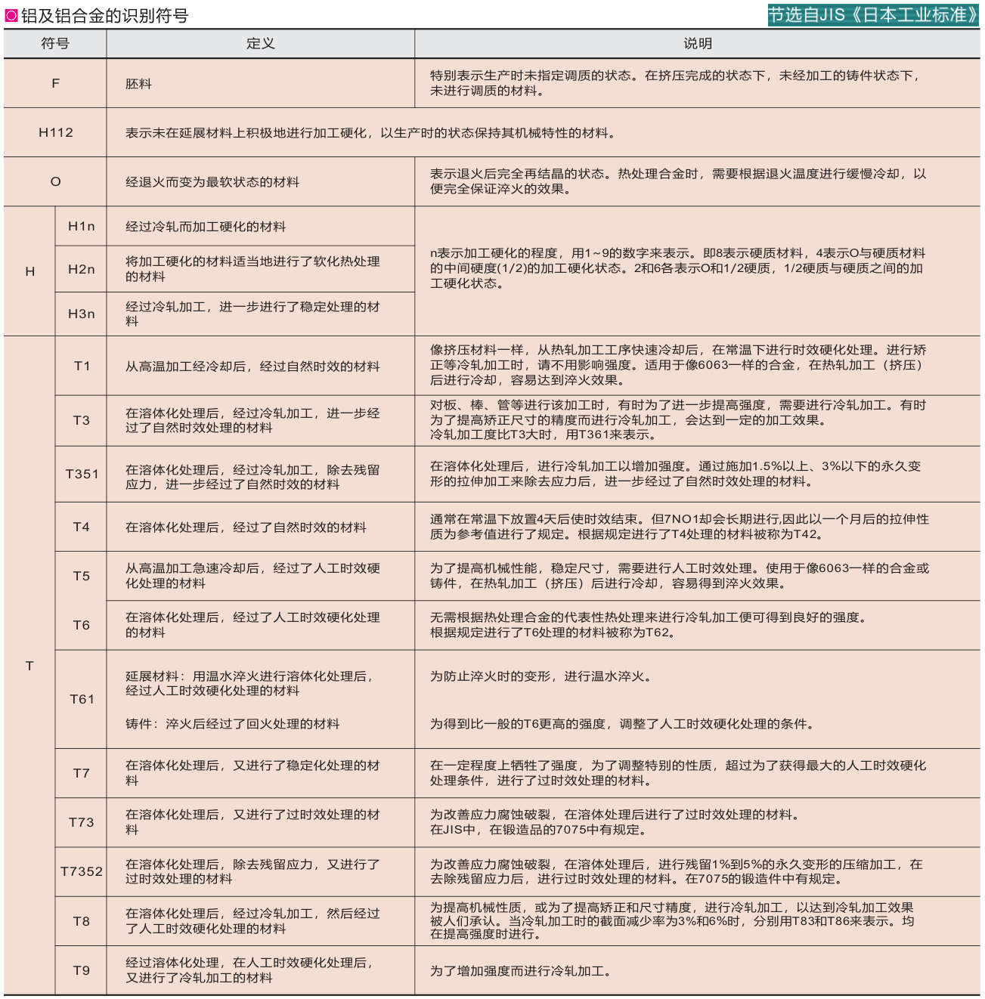

# 铝及铝合金

**铝**是一种金属元素，铝元素在地壳中的含量仅次于氧和硅，居第三位，是地壳中含量最丰富的金属元素。在金属品种中，仅次于钢铁，为第二大类金属。应用非常广泛。



```{note}
纯铝很少用到，一般都是使用铝合金制造零件。选择铝合金作为材料，一般就是看中它的质量轻，强度好，美观易加工等。
```

## 铝合金

纯铝不好用，但是在它里面添加合金元素形成铝合金，可以达到更好的性能。



由上图可以看出，变形铝合金共有八个系列。制作零件有一个最常用的型号6061(或A6061)，是6系合金，即铝镁硅系铝合金（一般情况下使用铝合金作为材料直接无脑选择A6061）。下图为一些常用铝合金材料。





**变形铝及铝合金的金牌号表示方法：**

- 纯铝的牌号命名法（1×××系列）
  - 铝的质量分数不低于99.00%时为纯铝，其牌号用1×××系列表示。牌号的最后两位数字表示最低铝百分含量（质量分数）。当最低铝的质量分数精确到0.01%时，牌号的最后两位数字就是最低铝百分含量中小数点后面的两位。牌号第二位的字母表示原始纯铝的改型情况。如果第二位的字母为A，则表示为原始纯铝；如果是B～Y的其他字母，则表示为原始纯铝的改型，与原始纯铝相比，其元素含量略有改变

- 铝合金的牌号命名法（2×××～8×××系列）
  - 铝合金的牌号用2×××～8×××系列表示。牌号的最后两位数字没有特殊意义，仅用来区分同一组中不同的铝合金。牌号第二位的字母表示原始合金的改型情况。如果牌号第二位的字母是A，则表示为原始合金；如果是B～Y的其他字母（按国际规定用字母表的次序运用），则表示为原始合金的改型合金。

```{note}
关于变形铝及铝合金的金牌号表示方法具体可查阅GB/T 16474-2011
```


- 资料：
  - https://mp.weixin.qq.com/s/-NmVn7VqkoF9toWfhEt_BA
  - https://openstd.samr.gov.cn/bzgk/gb/newGbInfo?hcno=FF7FBCF486BEFC3602B697E56318BF14
  - https://www.mechtool.cn/metalmaterial/metalmaterial_physicalandmechanicalpropertyofaluminum.html
  - https://www.caishuku.com/article/detail.php?id=azhlNWIxMjYyMDI=


