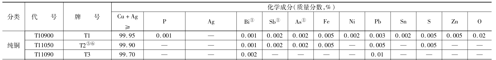
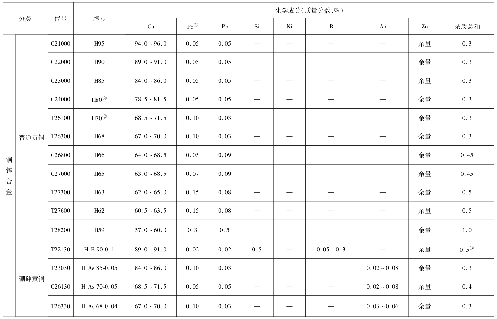
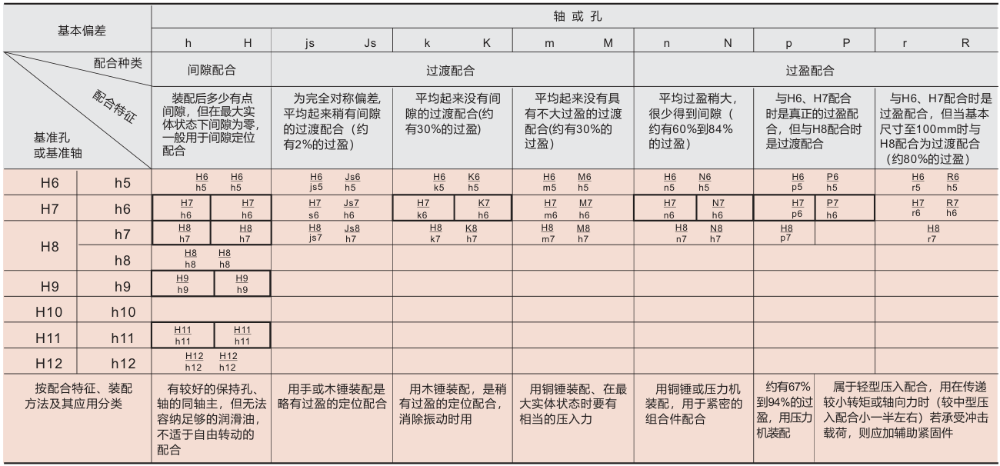
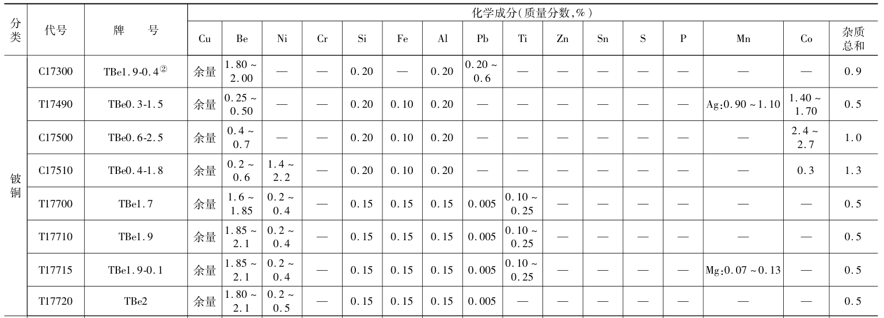
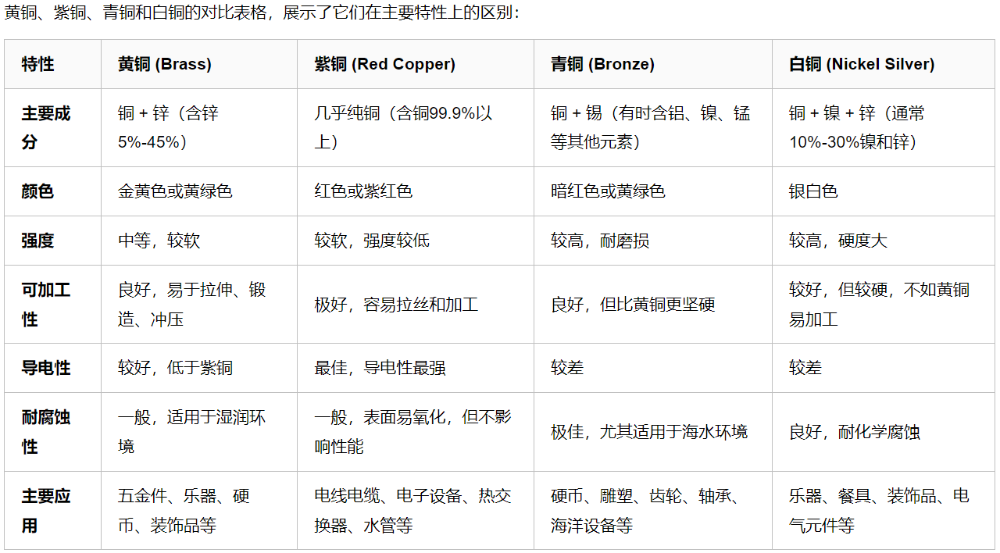

# 铜及铜合金

## 序

铜有**纯铜**和**合金铜**。把铜合金进行分类，有**黄铜**、**白铜**、**青铜**、**高铜合金**。

**黄铜：** 主要由铜和锌组成。

**白铜：** 白铜是铜与10%～30%镍的混合物。

**青铜：** 青铜是指添加了锡的铜合金。

**高铜合金：** 高铜合金指的是铜的含量达到或超过96%的铜合金。

资料来源：https://info-meviy.misumi.com.cn/details/16190/

## 纯铜

**纯铜**作为一种金属，相对较软，颜色为（紫）红色，别名紫铜，纯铜其实也不纯，其中铜的含量在99.90%以上。



```{note}
纯铜很软只是相对的，听说古代有一种刑罚叫金瓜击顶，太逆天了。
```

特性：

- 具有良好的延展性、导热性和导电性，因此被广泛应用于电缆和电气、电子元件、建筑材料和合金等领域。
- 在所有铜合金中，纯铜具有最高的导电性和导热性。它还具有非磁性，不会被磁铁吸引。
- 由于在其表面形成了一层氧化铜保护膜，因此它还具有出色的耐腐蚀性。
- 此外它还具有抗菌特性，可用于与人手接触的地方和水源周围。

## 黄铜

黄铜是由铜和锌所组成的合金。由二种以上的元素组成的多种，合金就称为特殊黄铜。如由铝、铅、锡、锰、镍、铁、硅组成的铜合金，高力黄铜就是其中一种。高力黄铜有较强的耐磨性能，高力黄铜强度高、硬度大、耐化学腐蚀性强。



特性：

- 与纯铜相比，黄铜具有良好的延展性、热锻造性和机械加工性，而且重量较轻。
- 它具有与黄金相似的美丽金属光泽，可用于制造硬币、电子零件、精密机械、乐器和装饰零件等。

```{note}
此外，还有硼砷黄铜，铅黄铜（铜锌铅合金），锡黄铜（铜锌锡合金），硅黄铜等，这些都是黄铜，不常用，暂不整理。
```

本人所选用时，一般使用的是铜的导电性、较软和耐磨性。

- 当需要导电的时候，可以使用H62做零件，起到导电的作用。上表显示H后面的数字越大，铜含量约高，所以我怀疑H62的导电性大于H59。（H62价格较高）

- 有时候会把黄铜做成代替直线轴承的零件，也可以使用H59，H62等。这可能是应为黄铜较软，不容易破坏零件且具有良好的耐磨性。

- 有时候会做成铜套，外径p6公差，过盈配合到某载具板上（H7/p6），不经常拆卸，与板子形成一个整体，保护板子且耐磨并较软，不易损坏销子。内径G6公差与销子配合进行定位，可经常拆卸。

  

## 高铜合金-铍铜

**高铜合金**指的是铜的含量达到或超过96%的铜合金。其特点是具有与纯铜相同的导热性和导电性，但强度和耐热性更高。

**铍铜**是一种高铜合金，它是一种具有导电性和高弹性的材料，铍铜又称铍青铜，是铜合金中的“弹性之王”，其力学性能，即强度、硬度、耐磨性和耐疲劳性居铜合金之首。




资料：

- https://info-meviy.misumi.com.cn/details/16190/
- https://www.kepuchina.cn/article/articleinfo?business_type=100&ar_id=319242


## 各种铜资料对比



资料：https://www.cnblogs.com/suv789/p/18597893

------

**白铜青铜等暂不整理**


