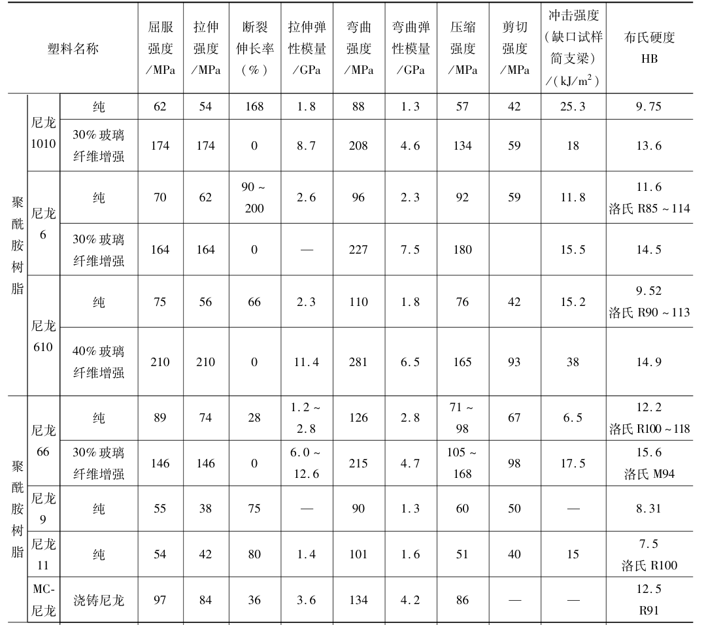
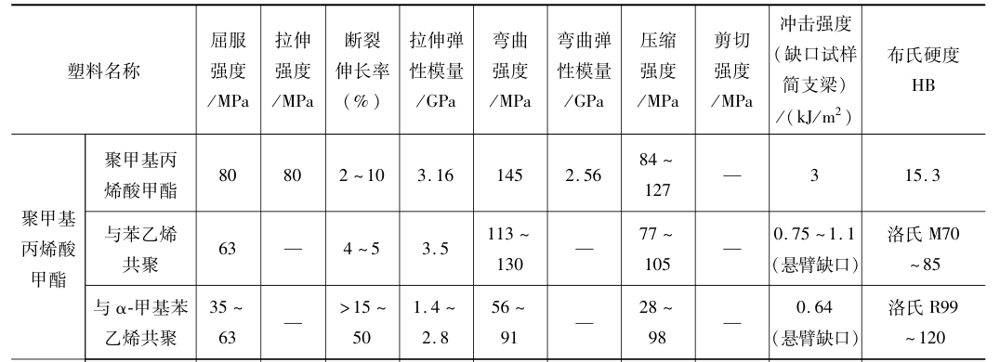
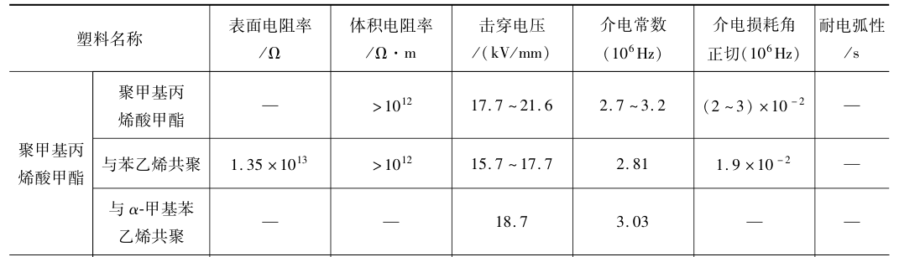
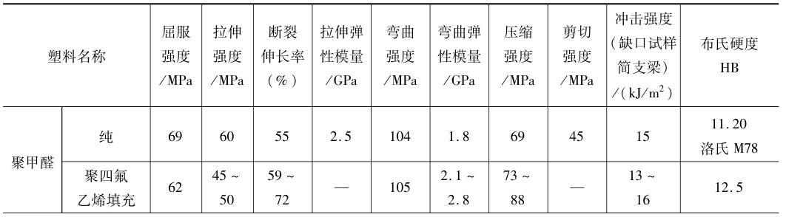
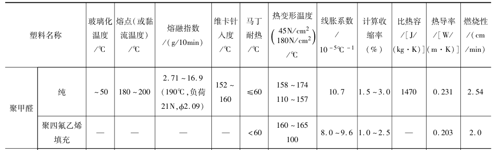

# 常用塑料

|           名称           |   缩写   |      中文名      |
| :----------------------: | :------: | :--------------: |
| 丙烯腈-丁二烯-苯乙烯塑料 | **ABS**  |     ABS塑料      |
|          聚酰胺          |  **PA**  |       尼龙       |
|         聚碳酸酯         |  **PC**  |      PC塑料      |
|     聚甲基丙烯酸甲酯     | **PMMA** | 亚克力，有机玻璃 |
|        聚氧亚甲基        | **POM**  |      聚甲醛      |
|         聚氯乙烯         | **PVC**  |     PVC塑料      |

```{note}
鄙人较常用的两种材料：POM，有机玻璃。
```

## ABS

ABS树脂是由丙烯腈、丁二烯和苯乙烯合成的三元共聚物，具有优良的耐低温冲击性能，表面硬度高，耐化学性及电性能良 好，ABS具有从低到高不同光泽度，其中低光泽度的ABS树脂可以满足在IT（信息技术）产品应用中广泛使用皮纹表面的特殊要求。

用途：

- 产品主要用于制作家用电器和家用电子设备的零部件，其中包括电视机、收录机、电冰箱、洗衣机、空调机、饮水机、 电话机、电风扇等的外壳、内衬和配件。
- 在机械工业中可用 于制造齿轮、叶轮、轴承、把手、管道、仪表盘等。
- 在汽车 工业中用于制作仪表板、挡泥板、扶手。
- 还广泛用于制作箱 包、办公设备、复印机、玩具、食品包装容器以及家具等。 ABS制品可以进行电镀、焊接、表面涂饰等二次加工，加工 后可替代金属制作装饰件。

```{note}
本人使用较少，暂不讨论，听说ABS是3D打印常用材料。
```

## PA



聚酰胺俗称尼龙（Nylon），英文名称Polyamide（简称PA）。又译为奈纶、耐纶、尼纶、锦纶。

特点：

尼龙大优点是结实耐磨，密度小，织物轻，弹性好，耐疲劳破坏，化学稳定性也很好，耐碱不耐酸！

大缺点是耐日光性不好，织物久晒就会变黄，强度下降，吸湿也不好，但比腈纶，涤纶好。

由于聚酰胺具有无毒、质轻、优良的机械强度、耐磨性及较好的耐腐蚀性，因此广泛应用于代替铜等金属在机械、化工、仪表、汽车等工业中制造轴承、齿轮、泵叶及其他零件。

```{note}
本人没用过，一般有脚轮有尼龙材料的，具体应用场景还不知道
```

## PC

```{note}
本人没用过，具体应用场景还不知道
```

## PMMA





```{note}
有机玻璃，一般用作透明门等。
```

## PVC

有硬质PVC和软质PVC两种，两者差距较大,且其他性能也有较大差异。

**硬质PVC**在户外环境下表现良好，具有优异的机械性能、刚性、耐候性和耐化学性。广泛用于建筑和工程领域，它可以用于制造管道、窗框、地板、墙板等。

**软质PVC**具有柔软性、可弯曲性和可塑性，适用于需要可变形的应用。它被广泛应用于电线电缆绝缘层、挤塑制品（如密封条、管道）、充气玩具等，同时也常见应用于医疗器械中，如输液管、人工血管等。

用途：

- PVC可以用作建筑材料、电子电器材料、医疗器械材料、包装材料等等。
- PVC制品具有良好的抗刮擦和耐磨损能力，不易受到日常磨损的影响。

```{note}
PVC有两个比较大的缺点，即热不稳定性和脆性（抗冲击性能差）。PVC在光照或受热的条件下，从80℃就开始塑料软化，当温度达到100℃以上时材料就开始发生降解，同时，制品的颜色开始从白色逐渐变成褐色最后变成黑色，这对于制品的外观有很大的影响。硬质PVC成品的缺口冲击强度大约是3~5KJ/㎡，材料的脆性大，当温度降低时材料会迅速的变得又硬又脆，严重影响其使用性能；而软质的PVC制品存在小分子增塑剂（如DOP）等的往材料表面的迁移。
```

**注：** PVC食品保鲜膜含有有害物质，对人体存在较大危害，其中的有害物质容易溶解并与食物接触，进而进入人体，可能导致致癌作用并干扰人体内分泌系统，这种干扰可引起妇女乳腺癌、新生儿先天缺陷、男性生殖障碍甚至精神疾病等健康问题。据国家塑料制品监督检验中心主任翁云宣介绍，PVC食品保鲜膜存在两个方面对人体健康造成危害的问题。首先，PVC材料中含有氯，而氯乙烯单体可能会挥发出来，对人体产生潜在的危险。其次，PVC保鲜膜通常使用乙基己基胺（DEHA）等增塑剂，而这些增塑剂可能会溶解并与食物接触。DEHA物质可能会渗出，并随食物进入人体，对人体健康造成潜在的致癌作用，特别是可能对内分泌系统和荷尔蒙产生干扰，因此对人体健康带来较大的危害。

来源：https://globalbaike.com/386448/

```{note}
皮带有PVC材质的，主要用于食品，医疗等领域
```

## POM





综合性能良好，强度、刚度高，冲击强度、疲劳性能、蠕变性能较好，减摩耐磨性好，吸水小，尺寸稳定性好，但热稳定性差，易燃烧，长期在大气中曝晒会老化

适于制作减摩零件、传动零件、化工容器及仪器仪表外壳

```{note}
非标自动化常用的一种塑料材料，一般黑色较多。
```


