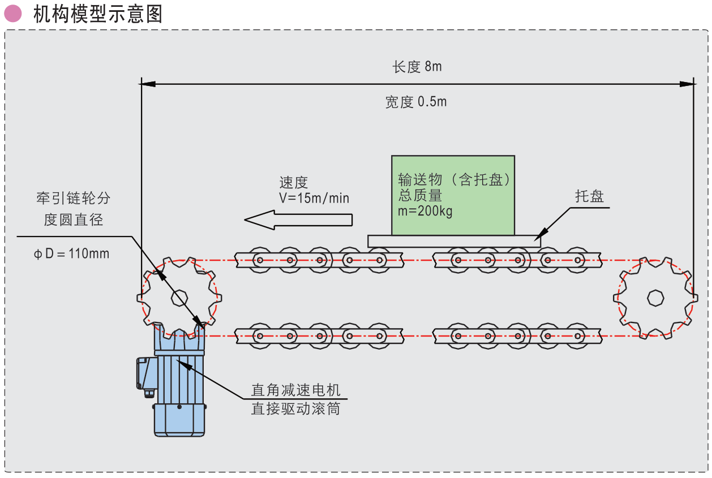

# 倍速链输送带

## 条件

1. 托盘与重物总输送物最大质量m=200kg。
2. 倍速链：3倍速。
3. 牵引链轮分度圆直径D=110mm，半径R=55mm。
4. 托盘输送速度V=15m/min。
5. 支撑方式：托盘与滚轮的滚动摩擦系数μ=0.12。
6. 运转模式：连续运转。

## 计算

### 托盘产生的滚动摩擦转矩M1

$$
M1=umg R=0.15\times 200\times 9.8\times 0.055=16.17N.m
$$

### 3倍速后至牵引链轮的转矩M2

$$
M2=M1\times 3=16.17\times 3=48.51N.m
$$

### 测量无输送时，输送带自身空转所需转矩M3

$$
M3=15N.m
$$

​	注：结合实际，根据经验。

### 总负载转矩M

$$
M=(M2+M3)\times 1.5=(48.51+15)\times 1.5=95.3N.m\\
$$

​	注：S为安全系数，推荐值为1.5~2。

**若输送带有跑偏情况，还需计算跑偏摩擦转矩M4**
$$
M=(M2+M3+M4)\times 1.5
$$

$$
M4=m\times g\times K\times \mu _1\times R，(单位：N.m)\\
$$

​	K:侧向负载系数，参考值0.2~0.3。

​	μ1:托盘与侧边条滑动摩擦系数，参考值为0.2~0.3。

### 减速电机转速

$$
n=\frac{v}{3\pi D}=\frac{15}{3×3.14\times 0.11}=14.48r/min
$$

若牵引端与减速电机输出端存在链轮传动等，需再计算传动比。

如，牵引端链轮Z1=19齿，减速电机输出端Z2=15齿，则：
$$
n=\frac{v}{3\pi Di}\\
$$

### 减速电机功率

$$
P=\frac{Mn}{9.55\eta }=\frac{95.3\times 14.48}{9.55\times 0.8}=180W
$$

​	注：若采用单相电机，因单相电机启动转矩仅为额定转矩的0.7倍，故减速电机功率应加大1÷0.7=1.43倍。

### 选择电机

​	**以P＞180W、M＞95.3N.m、n=14.48r/min(查精研手册选择电机)。**

