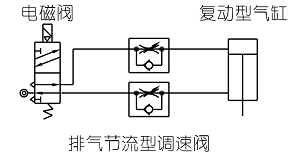
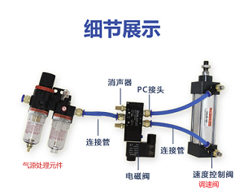
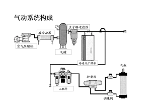
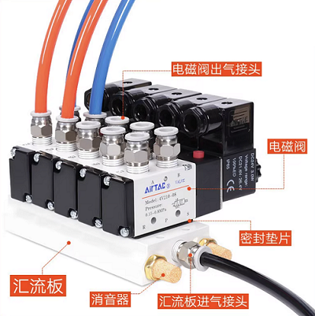
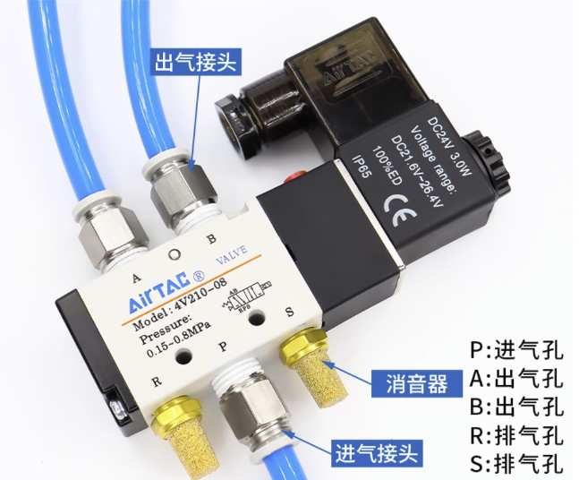
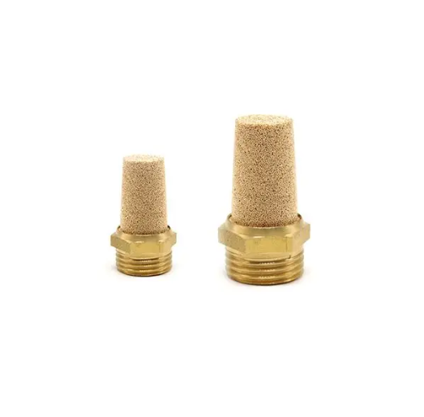
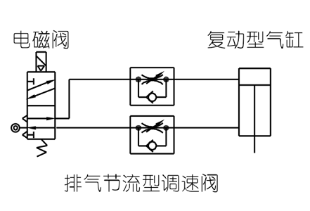
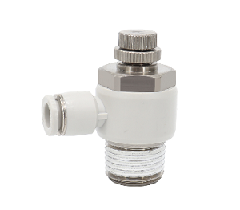
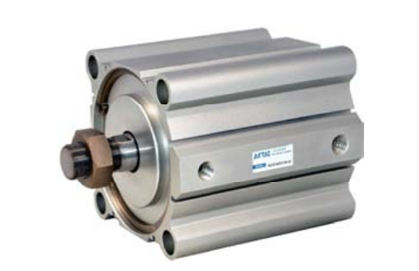
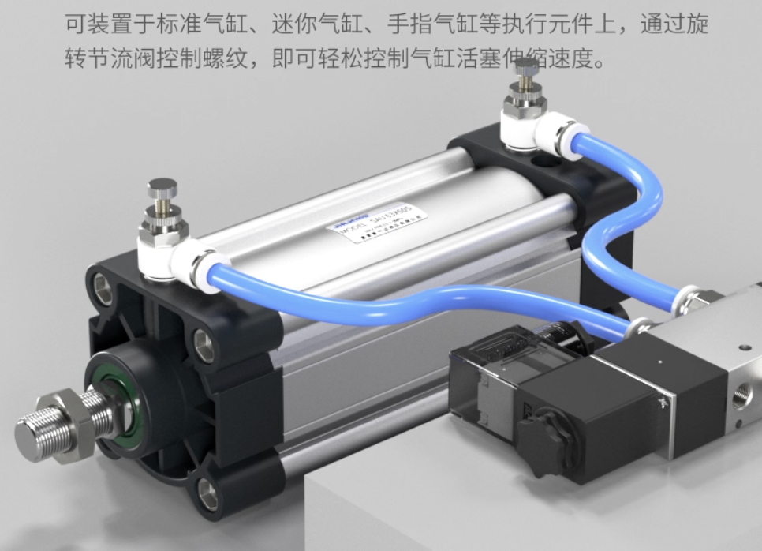

# 序

气动系统主要用于设备动作的执行，比如气缸的伸缩，旋转，夹紧等。

## 简单回路系统

气缸、电磁阀、三联件（三联件有时可以简化，省略部分元件）是气路中最基本的三个元件。

|  |  |  |
| --------------------------------------- | ------------------------------------------------------------ | --------------------------------------- |

在厂里面，人家一般会有一套气动系统，专门制造压缩气体。在设备处，它会有一根有压缩气体的管子，该管子可以引出并插进某个设备的气源处理元件上。气体怎么产生的不用深入研究，只需要了解的是插进三联件前的压缩气体的压强是多大。

|                            电磁阀                            |                  阀岛                   |
| :----------------------------------------------------------: | :-------------------------------------: |
|  |  |

|                            电磁阀                            |                            消声器                            |
| :----------------------------------------------------------: | :----------------------------------------------------------: |
|  |  |

气体经过气源处理元件处理之后，通过连接管再插进电磁阀的进气口（P口）里面，电磁阀的另外两个口（A口，B口）接通气缸上的气孔。电磁阀可以控制为A进气，B排气；也可以控制为B进气，A排气，PLC控制不同的口进排气可以控制气缸的伸缩。电磁阀如果收到PLC的信号，就会执行相应的动作。如果收到伸缩伸缩伸缩的指令，气缸就会一直的伸缩伸缩伸缩。

当有多个气缸，需要多个电磁阀时，可能会使用到阀岛，用来控制多个执行元件。

|                       电磁阀与气缸连接                       | 调速阀                                                       |
| :----------------------------------------------------------: | ------------------------------------------------------------ |
|  |  |

|                             气缸                             |         调速阀（安装到气缸上）          |
| :----------------------------------------------------------: | :-------------------------------------: |
|  |  |

另外需要注意的是，气缸没有直接与气缸相连。气缸的两个气口上需要先安装上调速阀，气管是先接到调速阀上，调速阀再接到气缸上面。调速阀又可以调节气缸的运行速度。

### 基础知识3

双作用气缸是需要选择两位五通的电磁阀或三位五通电磁阀。

连接这些元件需要用到气动接头PU管，电磁阀上有五个螺纹孔一侧有三个另一侧有两个，三个孔那一侧中间那个大一点的是进气孔，进气孔接上三联件（注意三联件是有方向的），旁边两个是排气孔，排气孔只需要装上消声器即可。另外一边那两个孔，就是工作孔，这两个孔是接气缸的前后端盖上两个孔，这样基本上就组装起来了。

保持持继的气流经调压阀一般调整至0.4-0.5MPa的压力即可，通过给电磁阀通电、断电来控制双作用气缸的活塞做往复运动。

