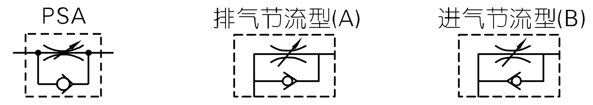

# 气动系统简介

气动系统主要用于设备动作的执行，比如气缸的伸缩，旋转，夹紧等。

## 简单回路系统

气缸、电磁阀、三联件（三联件有时可以简化，省略部分元件）是气路中最基本的三个元件。

|      气动系统（红色区域为设备处）       |                       一种简单连接方法                       |
| :-------------------------------------: | :----------------------------------------------------------: |
|  |  |

在厂里面，人家一般会有一套气动系统，专门制造压缩气体。在设备处，它会有一根有压缩气体的管子，该管子可以引出并插进某个设备的气源处理元件上。一般情况下，需要了解的是插进三联件前的压缩气体的压强是多大，以便各种标准件的选型计算。

气体经过气源处理元件处理之后，通过连接管再插进电磁阀的进气口（P口）里面，电磁阀的另外两个口（A口，B口）通过连接管接通到相应的调速阀上，调速阀接到气缸上的气孔上。电磁阀（PLC控制控制电磁阀）可以控制为A进气，B排气；也可以控制为B进气，A排气，PLC控制不同的口进排气可以控制气缸的伸缩。电磁阀如果收到PLC的信号，就会执行相应的动作。如果收到伸缩伸缩伸缩的指令，气缸就会一直的伸缩伸缩伸缩。


|                            电磁阀                            |                            消声器                            |
| :----------------------------------------------------------: | :----------------------------------------------------------: |
|  |  |

|                            电磁阀                            |            电磁阀安装到汇流板上             |
| :----------------------------------------------------------: | :-----------------------------------------: |
|  |  |

当一个设备上有多个气缸时，需要多个电磁阀时，可能会使用到汇流板，将一根气管通到汇流板的进气口，汇流板上安装上相应的电磁阀，用来控制多个气缸(执行元件)。

```{note}
据说还有一个称为阀岛的东西，比较高级，简单来说是电磁阀，控制模块与汇流板的集成。（电磁阀安装到汇流板上形成一个简单的阀岛）
下图为费斯托某阀岛图片。
```


## 电磁阀与气缸的简单连接

|                       电磁阀与气缸连接                       | 调速阀                                                       |
| :----------------------------------------------------------: | ------------------------------------------------------------ |
|  |  |

|                             气缸                             |         调速阀（安装到气缸上）          |
| :----------------------------------------------------------: | :-------------------------------------: |
|  |  |

```{note}
另外需要注意的是，气缸没有直接与气缸相连。气缸的两个气口上需要先安装上调速阀，气管是先接到调速阀上，调速阀再接到气缸上面。调速阀又可以调节气缸的运行速度。
```

## 调速阀



```{note}
调速阀的选择也有讲究，一般来说，调速阀有两种，排气节流型(A)和进气节流型(B)。
```

### 工作原理


### 一般选型方法


```{note}
一般来说，排气节流阀用于双作用气缸，进气节流型用于单作用气缸
```

## 气源处理原件

气源处理原件主要作用是，通断气源，过滤润滑压缩气体，稳定输出气压等。根据不同需求，气源处理原件可能是**二联件**，**三联件**，**五联件**等。

气源处理原件一般将输出气压控制在0.4-0.5MPa，具体为多大可调节。


--------

。。。。。。


双作用气缸是需要选择两位五通的电磁阀或三位五通电磁阀。

连接这些元件需要用到气动接头PU管，电磁阀上有五个螺纹孔一侧有三个另一侧有两个，三个孔那一侧中间那个大一点的是进气孔，进气孔接上三联件（注意三联件是有方向的），旁边两个是排气孔，排气孔只需要装上消声器即可。另外一边那两个孔，就是工作孔，这两个孔是接气缸的前后端盖上两个孔，这样基本上就组装起来了。


