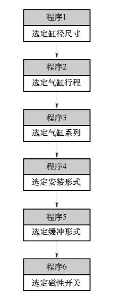
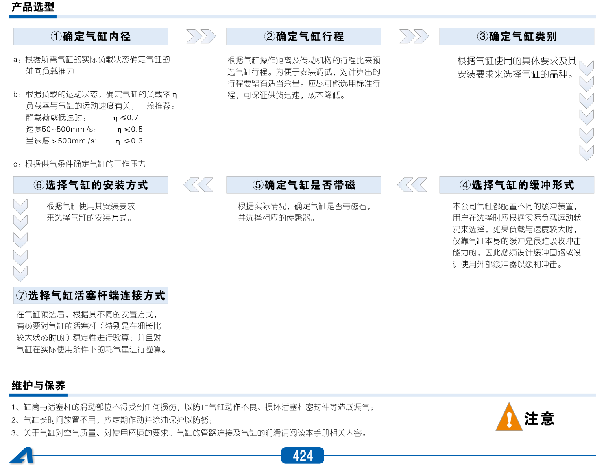
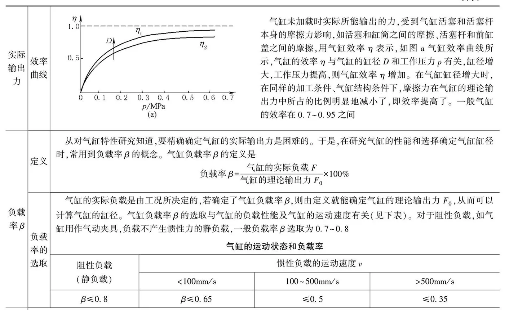
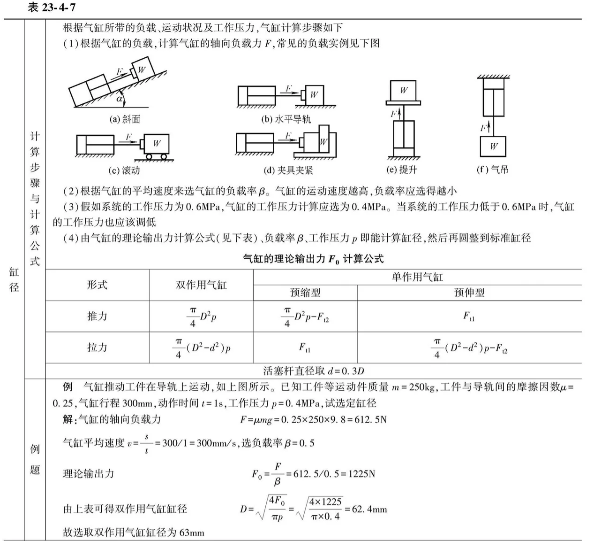
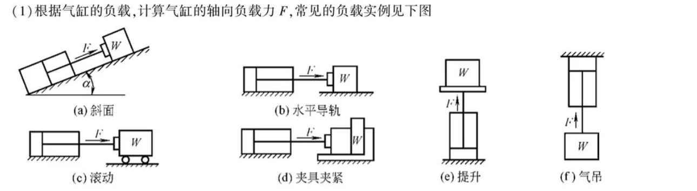
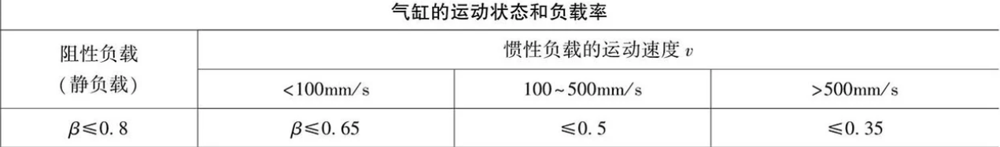
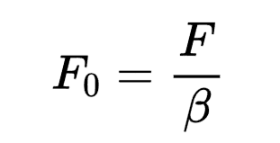
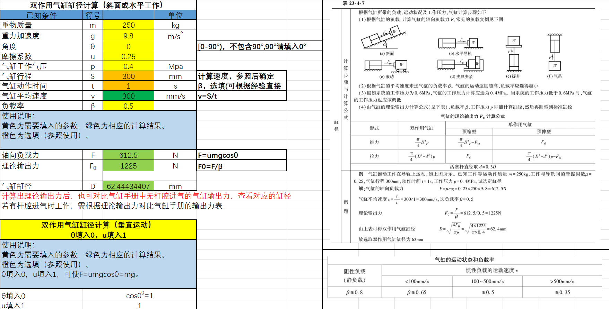
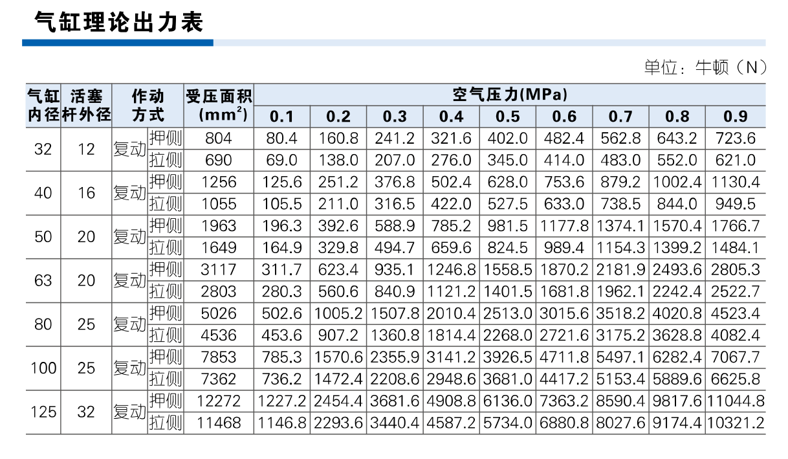

# 气缸选型计算

## 气缸选型流程

|                             图1                              |                             图2                              |
| :----------------------------------------------------------: | :----------------------------------------------------------: |
|  |  |
|                                                              |                                                              |

## 气缸缸径选型资料

## 选型过程

### 1.确定缸径尺寸

1. **计算气缸的轴向负载力，根据具体情况分析**

   

2. **工作负载率选择：** **负载率β选择**，负载效率0.7，0.5，0.3，......

   

3. **计算所需理论输出力**

   | 理论输出力： |  |
   | ------------ | :----------------------------------------------------------: |

4. **计算好理论输出力后也可根据手册的气缸理论出力表选取对应缸径的气缸**

**计算示例：**

**气缸理论出力图例：**

| 图3-理论出力表-（仅供参考：不同气缸请查不同的气缸理论出力表） |
| :----------------------------------------------------------: |
|  |

### 2.选定气缸行程

根据实际

### 3.选定气缸系列

根据实际情况，例如SE、MI系列等

### 4.安装形式

根据实际需要

### 5.缓冲形式

根据实际需要

### 6.磁性开关

根据实际需要

## 计算网站推荐

1. [mechtool](https://www.mechtool.cn/calculation/calculation_pneumaticdrivesystemcalculation.html)

