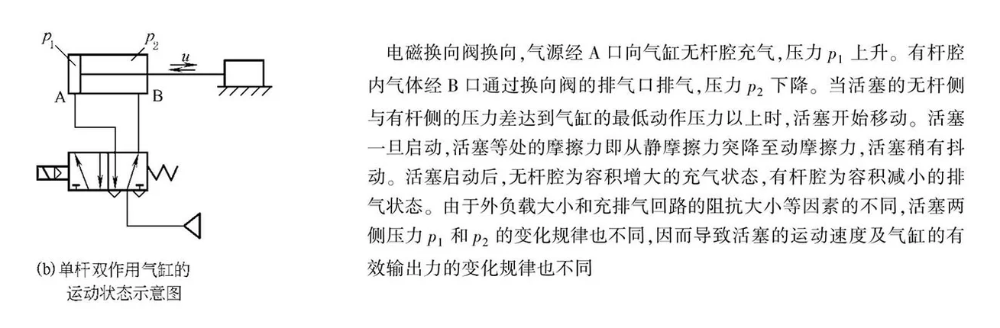
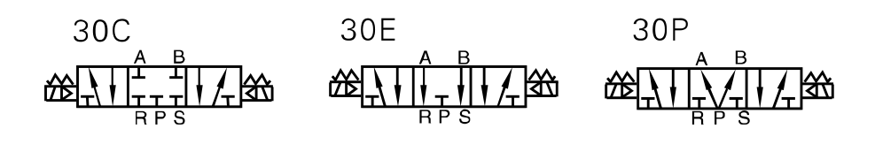
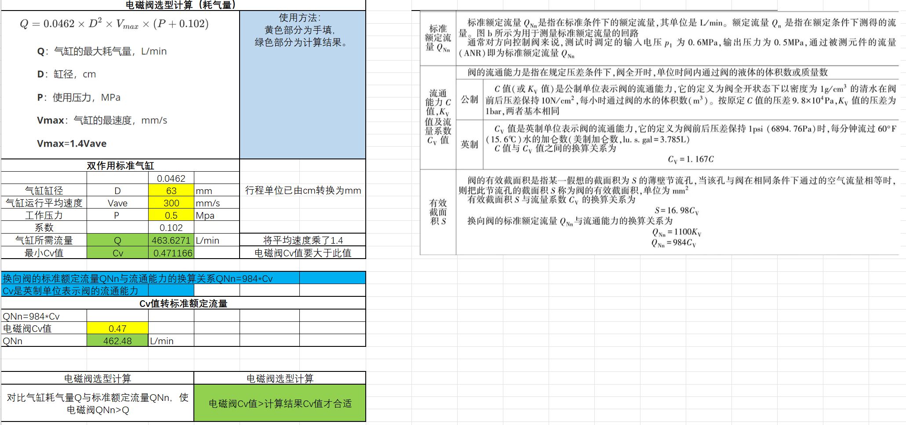
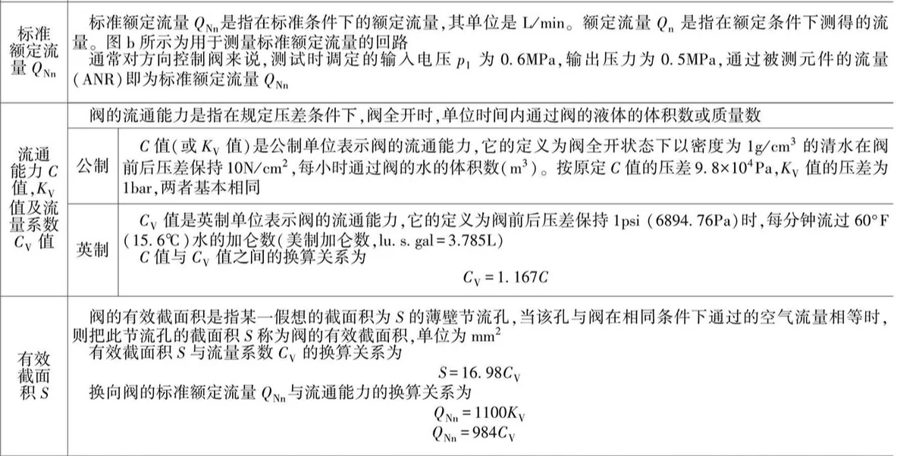

# 电磁阀

## 电磁阀的形式

**直动式还是先导式**

|          | 直动式电磁阀                                                 | 先导式电磁阀                                                 |
| -------- | ------------------------------------------------------------ | ------------------------------------------------------------ |
| 简介     | 一般是用于**小口径，低压力**的环境，这种结构的阀门打开时，不需要要求介质的最低压力，零压启动，所以相比先导式电磁阀的的**启动速度，会来得更快一些**，特别适用于要求快速切断的场所中。 | 一般是用于**有压差、压力高、口径大**等场合，这种结构的电磁阀打开时，电磁阀需有一定的启动压力，如在没有压力情况下，只能打开先导孔、无法打开主阀口。此外先导式电磁阀相比于直动电磁阀的**流通能力要来得大**，**一般CV至可以达到3以上**。**对于压缩空气的纯净度要求较高，直动的就没有那么严格了**。 |
| 工作原理 | 通电时，电磁线圈产生电磁力把关闭件从阀座上直接提起，电磁阀门打开；断电时，电磁力消失，弹簧把关闭件压在阀座上，电磁阀门关闭。 | 通电时，电磁力会把先导孔打开，这样使电磁阀中的上腔室压力迅速降下，在关电磁阀闭件周围形成上低下高的压差，流体压力推动关闭件向上移动，电磁阀门打开；断电时，弹簧力把先导孔关闭，入口压力通过旁通孔迅速腔室在关阀件周围形成下低上高的压差，流体压力推动关闭件向下移动，关闭阀门。 |
| 特点     | **功耗比先导式电磁阀大**，一般在15-30W，高频通电容易烧毁线圈，但是**控制简单，使用范围广**。在真空、负压、零压时能正常工作，但通径一般不超过50mm。 | 电磁头小，**功耗小**，0.1-0.2w，可频繁通电，长时间通电，而不会烧毁，而且节能。流体压力范围上限较高(可根据需求定制)，但必须满足流体压差条件，不过**液体的杂质容易堵塞先导阀孔，不适用于液体使用**。 |

注：流体有杂质容易导密封面磨损，密封不严、不适用于有杂质及颗粒物流体。

### 区别和应用

| 序号 | 区别           | 直动式电磁阀 | 先导式电磁阀 |                                                              |
| ---- | -------------- | ------------ | ------------ | ------------------------------------------------------------ |
| 1    | 承受压力       | 较小         | 较大         | 先导式电磁阀的承受液压力，比直通式电磁阀承受压力大。         |
| 2    | 响应时间       | 较快         | 较慢         | 直动式电磁阀的启动速度相比先导式来得快，多用于快速切断的场所。因为先导式电磁阀是通电后小阀先开启，主阀后开；直动式电磁阀则是主阀直接打开。 |
| 3    | 流通能力       | 较小         | 较大         | 先导式电磁阀的流通能力相比于直动式要大一些，一般CV值可达3以上，而直动电磁阀的一般CV值都是小于1。 |
| 4    | 功率和损耗     | 较大         | 较小         | 直动式电磁阀功率和损耗要比先导式更大。                       |
| 5    | 介质洁净度要求 | 较低         | 较高         | 先导式电磁阀对流通介质的纯净度要求比较高，直动式则没有那么严格了。 |

## 电磁阀的机能

**两位三通，三位五通等电磁阀**

**气缸与电磁阀选配关系：**

| 类型       | 电磁阀选择            |
| ---------- | --------------------- |
| 单作用气缸 | 选用3通电磁阀（一般） |
| 双作用气缸 | 选用5通电磁阀（一般） |

**中封式，中泄式，中间加压式电磁阀**

中封（30C），中泄（30E），中压（30P）这三种电磁阀为三位五通电磁阀

## 5.安装方式

管接式：

集接式：

## 6.电气参数

电压：

功率：

出线形式：

## Cv值计算选型

**注：根据使用的流量要求选择阀的型号、规格大小**

**注：计算气缸所需的流量，Cv值**

#### 计算示例：

气缸缸径：63mm，平均速度：300mm/s，工作压力0.5MPa。

计算电磁阀对应气缸的最大耗气量，然后根据耗气量计算Cv值，所选的电磁阀的实际Cv值要比计算出的Cv值大。

**注：Cv值为流量系数，表示英制单位阀的流通能力**

