# 气源处理元件选型

## 三联件（FRL）

空气过滤器（F）、减压阀（R）、油雾器（L）

|                 |                             图像                             |                             符号                             |                 说明                 |
| :-------------: | :----------------------------------------------------------: | :----------------------------------------------------------: | :----------------------------------: |
|     三联件      | 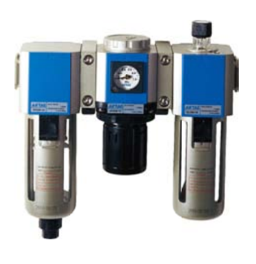 | 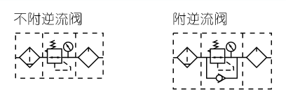 |                                      |
|     二联件      | 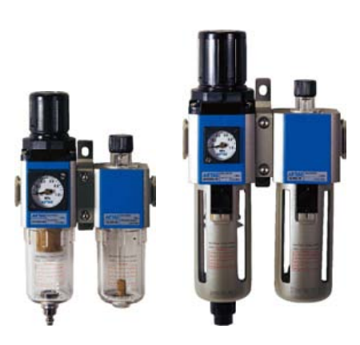 | 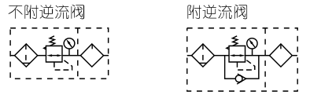 |                                      |
| 空气过滤器（F） | 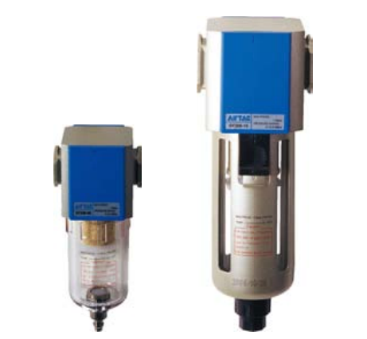 | 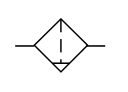 |                                      |
|   减压阀（R）   | 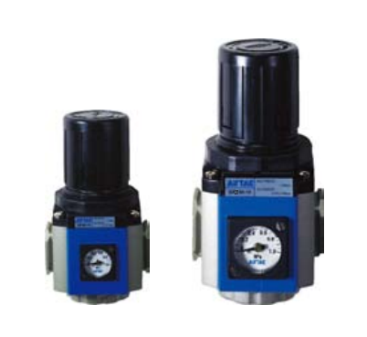 | 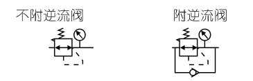 |                                      |
|   油雾器（L）   | 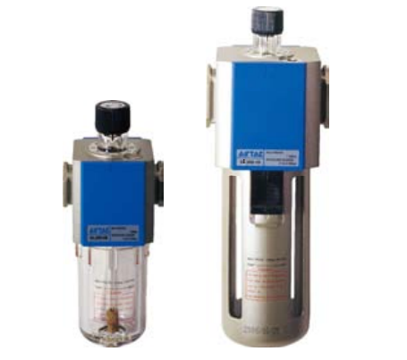 | 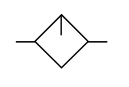 |                                      |
|      其他       |                                                              |                                                              | 气源处理元件还可以直接连接其他元件。 |

**某三联件规格型号**

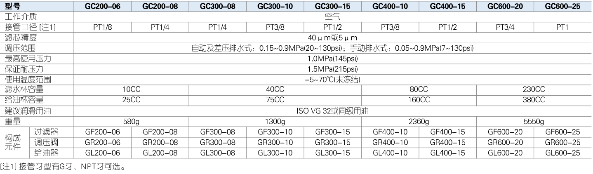

## 特性参数示例

### **某三联件（特性参数）**

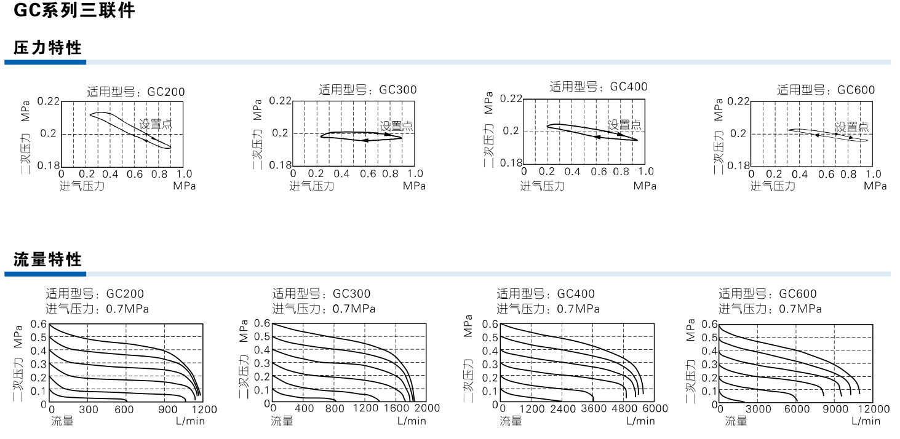

### **某二联件（特性参数）**

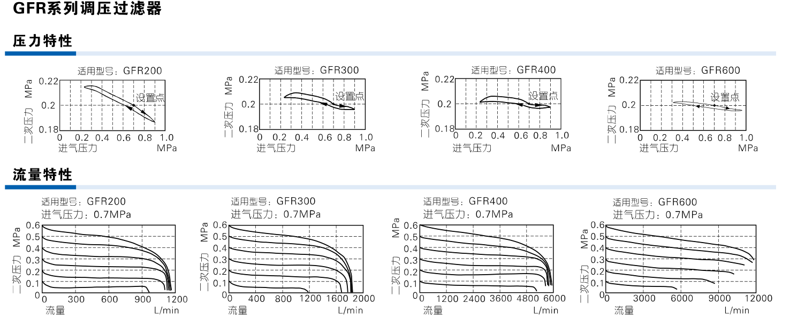

### **某过滤器（特性参数）**

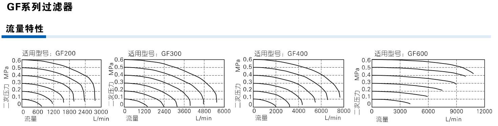

### **某调压阀（特性参数）**

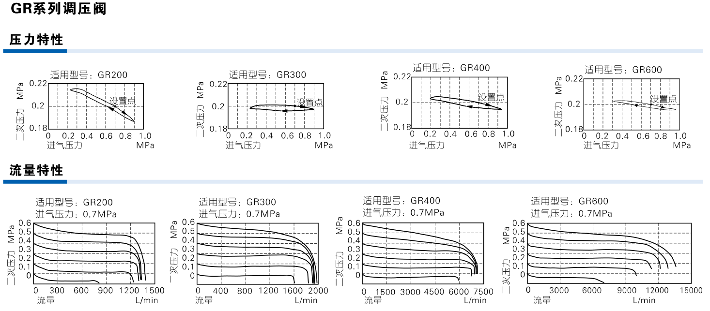

### **某给油器（特性参数）**

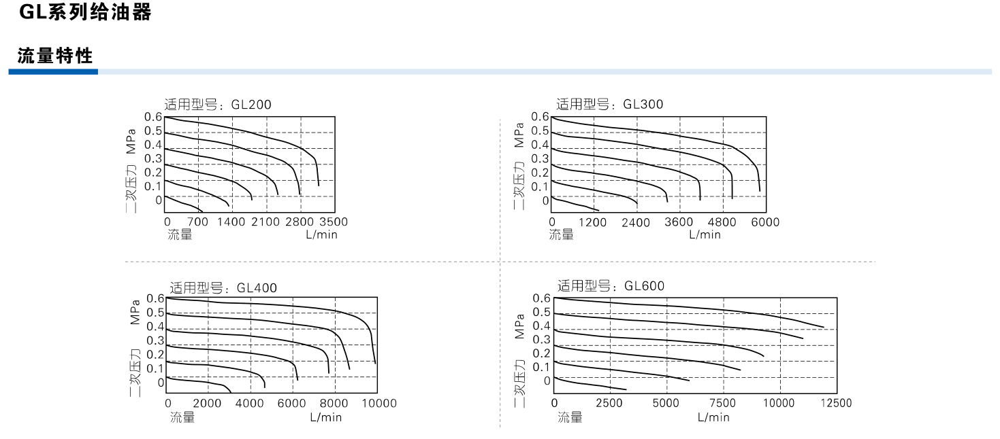

## 选型计算

-

-

-

-

-

-

------

## 某次使用记录

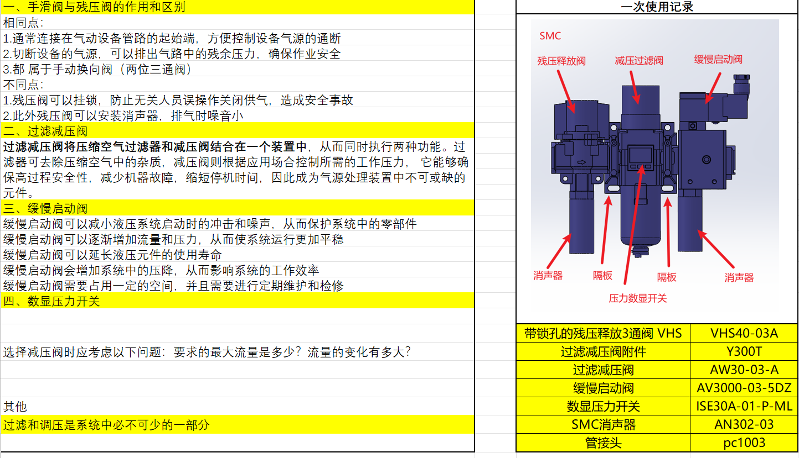

