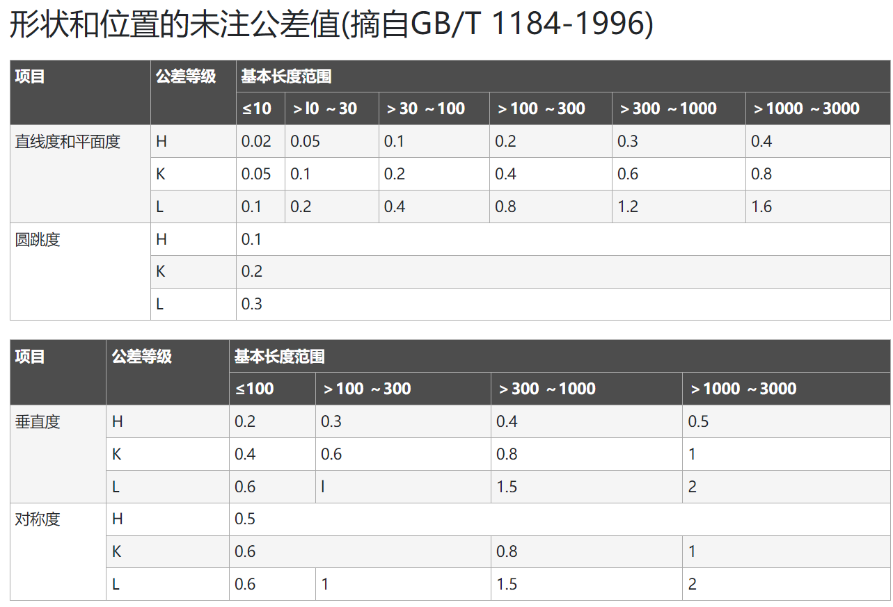
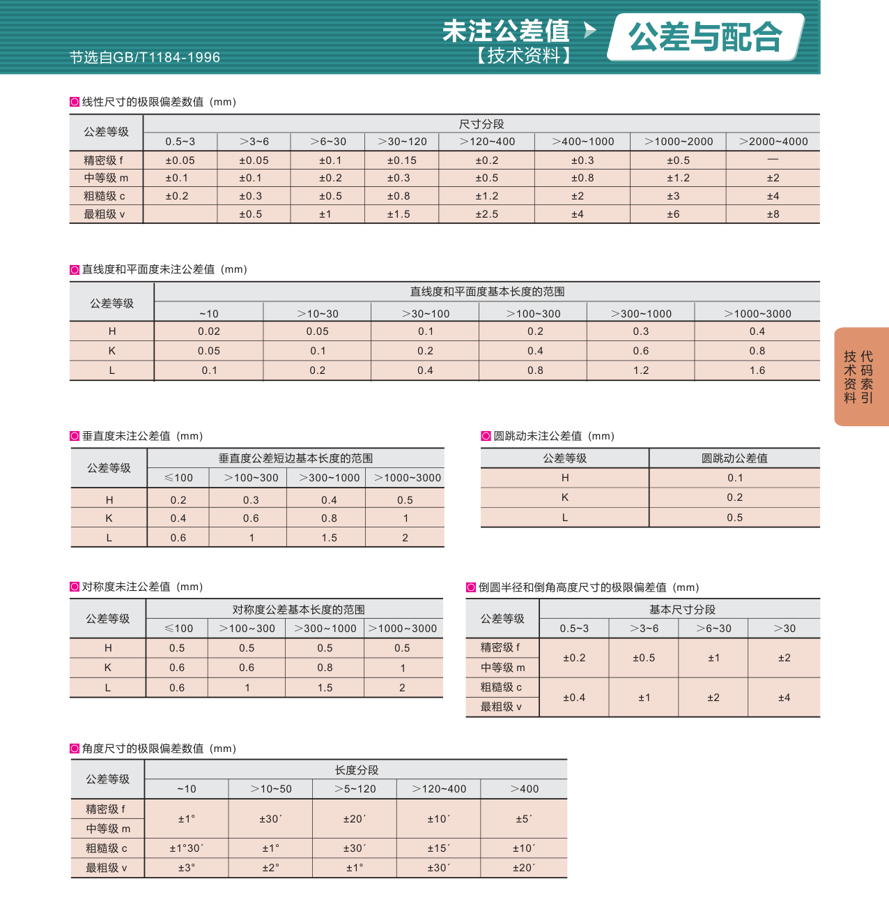
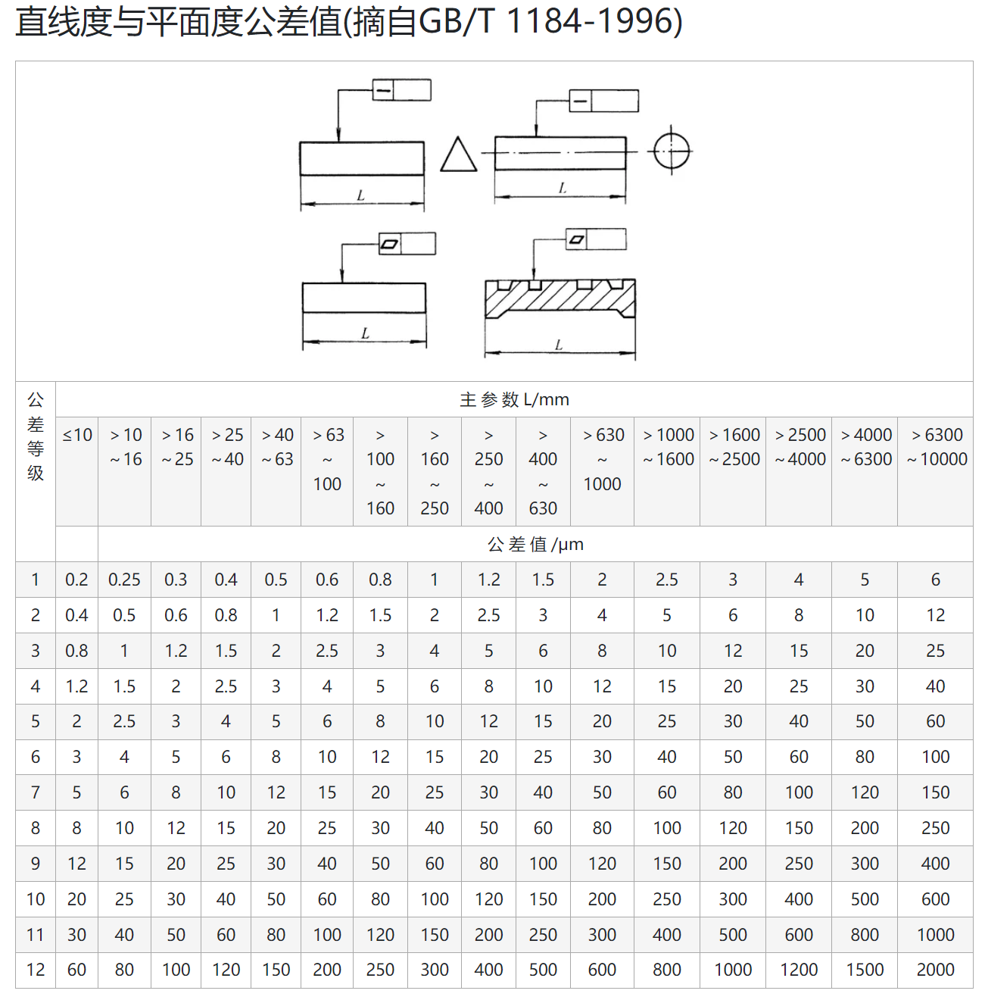
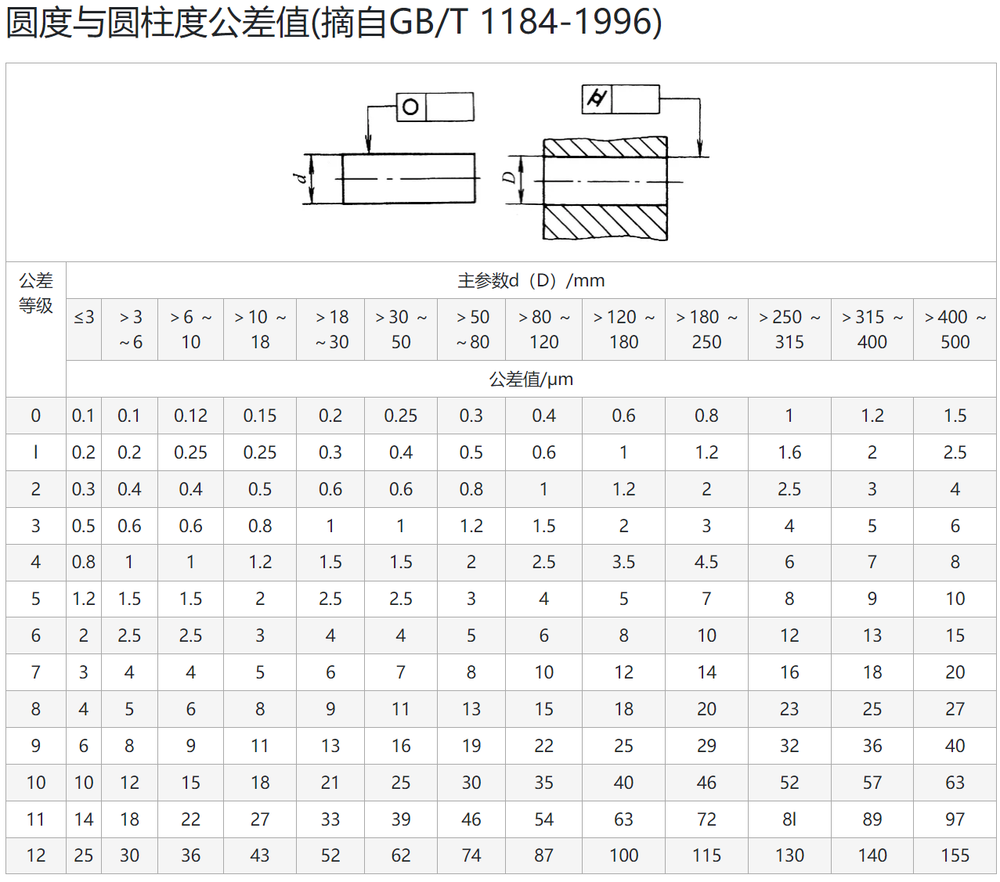
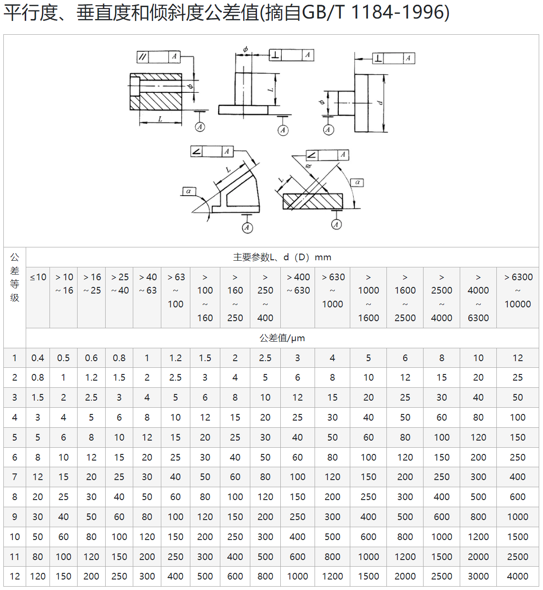
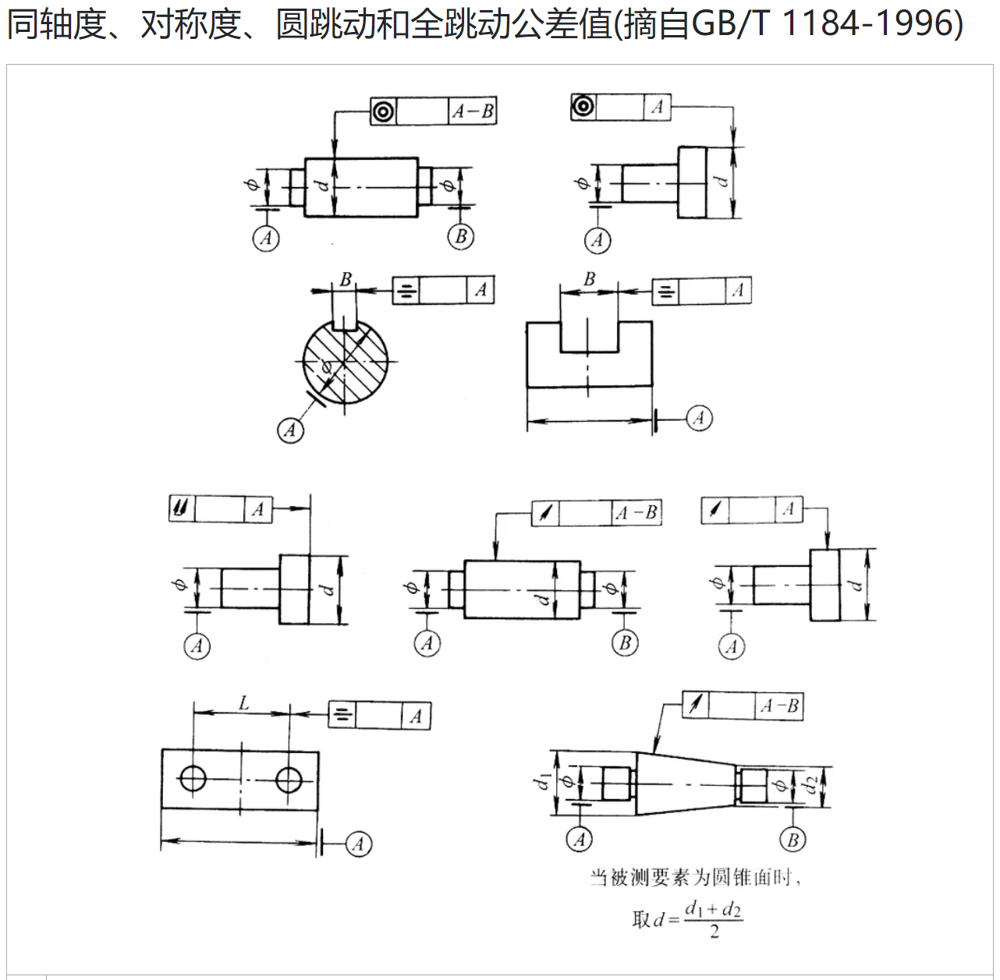
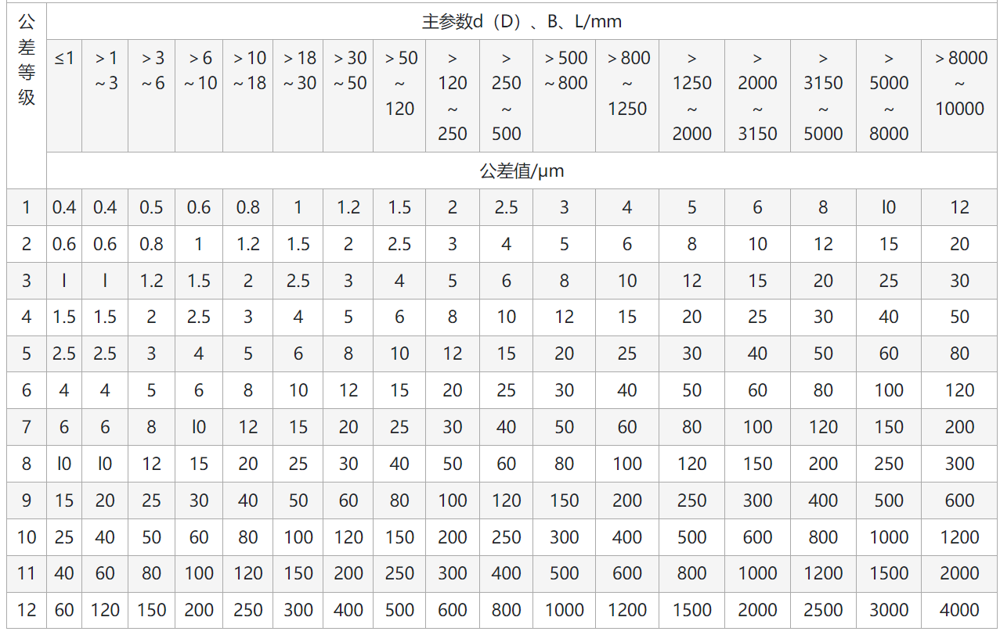
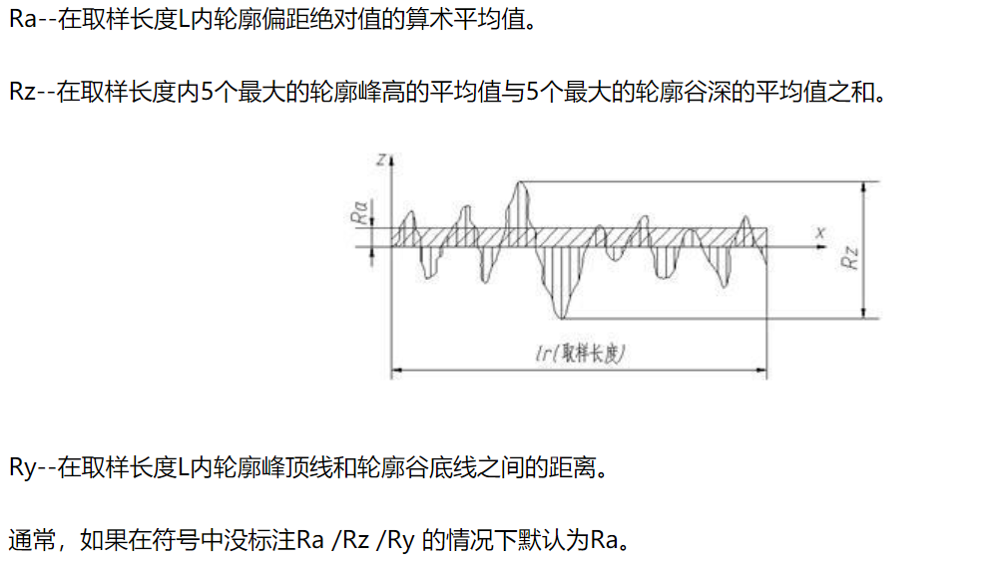

# 常用资料

## 螺栓扳手对应

|  |  |
| :----------------------------------------------------------: | :----------------------------------------------------------: |

## 公差

### 未注公差

### 直线度平面度公差

### 圆度与圆柱度公差

### 平行度、垂直度与倾斜度

### 同轴度、对称度、圆跳动、全跳动

## 表面粗糙度

### 表面粗糙度

### 表面粗糙度对机械零件的影响

表面粗糙度是指加工表面具有的较小间距和微小峰谷不平度。其两波峰或两波谷之间的距离（波距）很小，用肉眼是难以区别的，因此它属于微观几何形状误差。表面粗糙度越小，则表面越光滑。表面粗糙度的大小，对机械零件的使用性能有很大的影响，主要表现在以下几个方面：

1、表面粗糙度影响零件的耐磨性。表面越粗糙，配合表面间的有效接触面积越小，压强越大，磨损就越快。

2、表面粗糙度影响配合性质的稳定性。对间隙配合来说，表面越粗糙，就越易磨损，使工作过程中间隙逐渐增大；对过盈配合来说，由于装配时将微观凸峰挤平，减小了实际有效过盈，降低了联结强度。

3、表面粗糙度影响零件的疲劳强度。粗糙零件的表面存在较大的波谷，它们像尖角缺口和裂纹一样，对应力集中很敏感，从而影响零件的疲劳强度。

4、表面粗糙度影响零件的抗腐蚀性。粗糙的表面，易使腐蚀性气体或液体通过表面的微观凹谷渗入到金属内层，造成表面腐蚀。

5、表面粗糙度影响零件的密封性。粗糙的表面之间无法严密地贴合，气体或液体通过接触面间的缝隙渗漏。

此外，表面粗糙度对零件的外观、测量精度也有影响。

