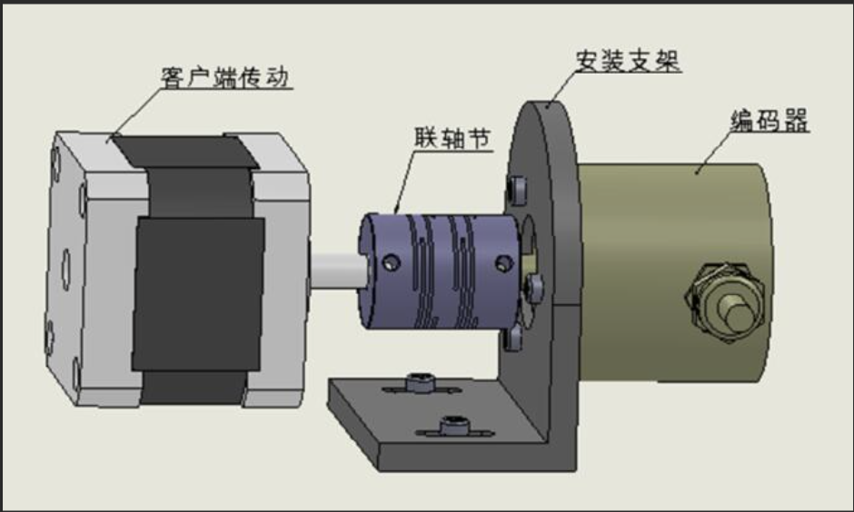
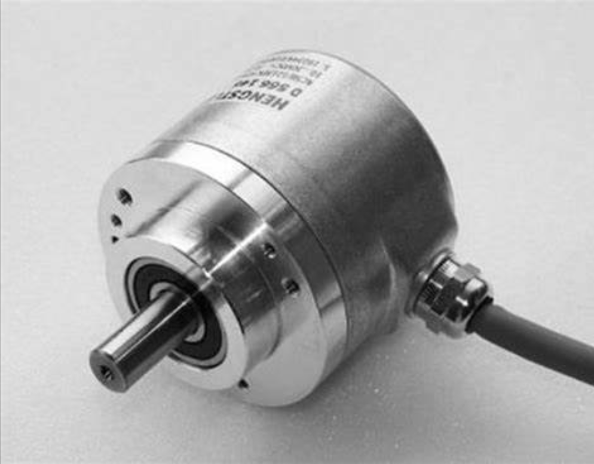

# 编码器

## 什么是编码器

[编码器百度百科](https://baike.baidu.com/item/%E7%BC%96%E7%A0%81%E5%99%A8/6029803)

**一种编码器的简单解释**

|                        编码器连接示例                        |                            编码器                            |                             说明                             |
| :----------------------------------------------------------: | :----------------------------------------------------------: | :----------------------------------------------------------: |
|  |  | 编码器与客户端传动相连，可以识别到客户端传动的转速，然后还能将获取到的信息传送给PLC。 |

## 分类

按照按码盘的刻孔方式不同分类可分为**增量式(SPC)**和**绝对值式(APC)**两类。

以编码器工作原理可分为：**光电式**、**磁电式**和**触点电刷式**。

### 增量式编码器与绝对式编码器

|      |                         增量式编码器                         |                         绝对式编码器                         |
| ---- | :----------------------------------------------------------: | :----------------------------------------------------------: |
| 介绍 | 增量式编码器是直接利用光电转换原理输出三组方波脉冲A、B和Z相；A、B两组脉冲相位差90。，从而可方便的判断出旋转方向，而Z相为每转一个脉冲，用于基准点定位。 | 绝对式编码器是直接输出数字的传感器，在它的圆形码盘上沿径向有若干同心码盘，每条道上有透光和不透光的扇形区相间组成，相邻码道的扇区数目是双倍关系，码盘上的码道数是它的二进制数码的位数，在码盘的一侧是光源，另一侧对应每一码道有一光敏元件，当码盘处于不同位置时，各光敏元件根据受光照与否转换出相应的电平信号，形成二进制数。 |
| 特点 | 它的优点是原理构造简单，机械平均寿命可在几万小时以上，抗干扰能力强，可靠性高，适合于长距离传输。其缺点是无法输出轴转动的绝对位置信息。 | 这种编码器的特点是不要计数器，在转轴的任意位置都可读书一个固定的与位置相对应的数字码。显然，码道数越多精度越大。 |

#### 增量式编码器

#### 绝对值式编码器

| 绝对值编码器         | 介绍                                                         | 特点                                     |
| :------------------- | :----------------------------------------------------------- | ---------------------------------------- |
| 什么是绝对值编码器？ | 绝对值编码器由机械位置决定的，每个位置是唯一的，它无需记忆，无需找参数点，不用一直计数，什么时候需要知道他的位置，什么时候就去读取它的位置 | 这样，编码器的抗干扰性，数据的可靠性高了 |
| 单圈绝对值编码器     | 只能用于旋转范围360度以内的测量，转动超过360度时，编码器又回到原点 |                                          |
| 多圈绝对值编码器     | 在单圈绝对值编码器的基础上再增加圈数的编码，以扩大编码器的测量范围，这样的绝对值编码器就称为多圈式绝对值编码器。 |                                          |

### 光电式编码器和磁电式编码器

[光电式编码器和磁电式编码器-资料](https://oidencoder.com/encoder/features-of-rotary-encoders/)

光电编码器和磁电编码器都有绝对式的类型

|          | 光电式绝对值编码器                                           | 磁电式绝对值编码器                                           |
| -------- | ------------------------------------------------------------ | ------------------------------------------------------------ |
| 组成     | 由光源、编码盘、光电检测器和信号处理电路组成。               | 由主轴、编码器盘、传感器和信号处理电路组成。                 |
| 精度     | 光电绝对值编码器的最高分辨率取决于编码盘上刻度线的数量。通常，它可以达到非常高的分辨率，比如22位，也就是2 的22次方个计数。 | 高精度的电磁式绝对值编码器可以做到单圈17位分辨率，正常校准之后的绝对精度是0.02~0.07°的范围绝对精度，重复定位精度和分辨率相关，就是1个位置值左右。 |
| 最大转速 | 最大转速取决于编码盘的设计和信号处理电路的速度。一般来说，光电绝对值编码器可以支持非常高速的旋转，例如几万转每分钟或更高。 |                                                              |
| 优势     | 1.高分辨率：光电编码器具有较高的分辨率，可以实现高精度的位置测量。2. 高速度：由于光电编码器使用光照射物体进行测量，光信号的传输速度非常快，因此可以适用于高速运动的应用场景。 3.无接触：光电编码器的工作原理是通过光线与编码盘进行交互，因此不会产生机械接触或磨损，具有较长的使用寿命和稳定性。 | 1.适用范围广：磁电编码器具有较好的适应性和稳定性，适用于各种环境和工况。 2.高精度：磁电编码器具有较高的分辨率和准确性，可以实现高精度的位置测量。 3.抗干扰性强：磁电编码器对于环境中的磁场干扰相对较不敏感，具有较好的抗干扰性能。 4.抗震动、耐冲击性能更好，磁电式绝对值编码器可以做到IP68防水防尘。 |
| 劣势     | 1.对环境要求高：由于光电编码器使用光线进行测量，对环境的光照条件和光线干扰比较敏感，需要在光照良好的环境下使用。 2.安装要求高：光电编码器需要在测量物体与光源之间保持一定的距离和角度，需要较为精确的安装。 |                                                              |

在选择时，需要根据实际需求和工作环境，以及对分辨率、速度、稳定性和耐久性的要求进行综合评估，选择最适合的编码器类型。

### 旋转变压器

相比于前面的光电编码器，旋转变压器更适用于各种恶劣的外部环境，如油污污染，大振动环境。这些场合光电编码器的码盘容易受污染使编码器输出幅值变小设置失效。大振动环境容易把码盘震碎，尤其是使用玻璃材质的码盘。

旋转编码器的缺点是模拟量传输易受到噪音干扰，分辨率不高，解码芯片1205只有12位分辨率，有些场合控制效果不太理想。

应用：坚固，可靠。

缺点：模拟量，易受噪音干扰，分辨率不高。

## 编码器常见参数

[精度和分辨率](https://oidencoder.com/encoder/encoder-linear-precision/)

### 分辨率

分辨率：指编码器能够分辨的最小单位。

对于增量式编码器，其分辨率表示为编码器转轴旋转一圈所产生的脉冲数，即脉冲数/转PPR。

码盘上透光线槽的数目其实就等于分辨率，也叫多少线，较为常见的有5-6000线。

对于绝对值编码器，内部码盘所用的位数就是它的分辨率，单位是位（bit），具体还分单圈分辨率和多圈分辨率。

### 精度

精度是指编码器每个读数与转轴实际位置间的最大误差，通常用角度、角分或角秒来表示。

例如，有些绝对值式编码器参数表里会写±20“，这个就表示编码器输出的读数与转轴实际位置之间存在±20角秒的误差。

（1度=60角分=3600角秒）

精度由码盘刻线加工精度、转轴同心度、材料的温度特性、电路的响应时间等各方面因素共同决定。

### 最大响应频率

最大响应频率是指编码器每秒输出的脉冲数，单位是Hz。计算公式为：

最大响应频率=分辨率*轴转速/60

例如：某电机的编码器分辨率为100（即光电盘码一圈有100条栅格），轴转速为120r/min，则响应频率为100*120/60=200Hz

### 信号输出形式

对于增量式编码器，每个通道的信号独立输出，输出电路形式通常有集电机开路输出、推挽输出、差分输出等。

对于绝对值式编码器，由于是直接输出几十位的二进制数，为了确保传输速率和信号质量，一般采用串行输出或总线型输出，例如同步串行接口（SSI）、RS485、CSNopen或EtherCAT等，也有一部分是并行输出，输出电路形式与增量式编码器相同。

