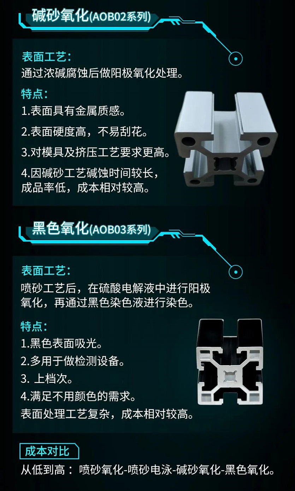
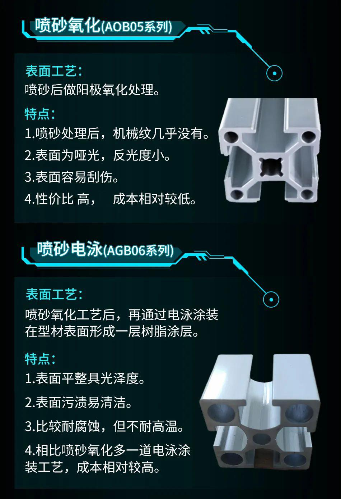

# 型材

## 怡和达型材

铝型材有铝锭挤压出来后，通过对表面进行处理来增强耐腐蚀性，使其适用于各种工作环境，增加其使用性能。

目前市面上流通较多的型材多维平光氧化表面处理，平光氧化处理会使表面产生较多线纹，整体的外观度略差。

选择合适的铝型材处理是型材加工中最为重要的环节之一，怡和达有以下四种表面处理方式。

|  |  |
| :----------------------------------------------------------: | :----------------------------------------------------------: |

