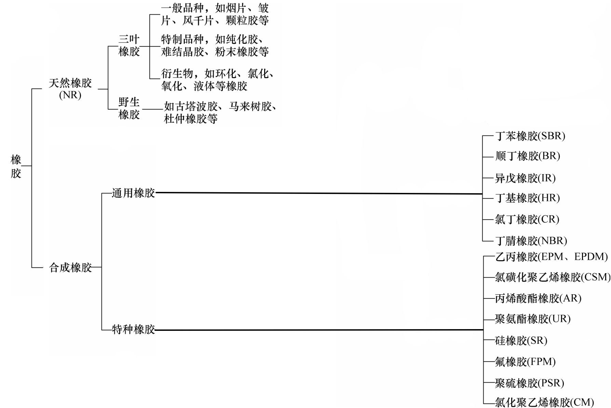
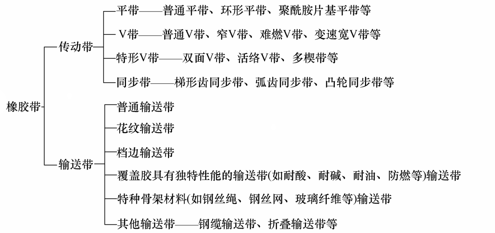

# 橡胶

美国材料测量协会（ASTM D1566）称，橡胶是一种材料，它在大的变形下能迅速地恢复其形变。

橡胶的分类：



以上为橡胶的分类，橡胶一般分为天然橡胶和合成橡胶，在本人所见到的橡胶用途中，一般用作传动带，密封等。不过这些橡胶一般不是天然橡胶，一般是合成橡胶。

- 橡胶皮带的具体做法本人不知，具体是哪种材料本人也不知，只是见过一种黑色的橡胶皮带，很结实。

  

- 关于橡胶作为密封材料，一般被制作为O型圈，O型圈的材料有丁腈橡胶(NBR)、碳氟化合物(氟橡胶或 FKM)等。

```{note}
橡胶的弹性使其能够反复压缩、拉伸和弯曲而不会损坏。
它耐热、耐紫外线、耐臭氧，并且耐化学腐蚀。
它密封性好，能有效减震、绝缘，并在极端环境下保持性能。
```

---

有资料显示天然橡胶，钢铁、石油和煤炭一起并称为四大工业原料，我不明白，后来搜了一下，觉得有点夸张，确实名不虚传。

- 搜狐新闻：[link](https://www.sohu.com/a/877261459_121141928)
- 中国天然橡胶协会：[link](https://www.cnraw.org.cn/index.php/article/tianranjiaoziyuan/8991.html)

---

来源：[橡胶](https://rubberandseal.com/zh-CN/%E6%A9%A1%E8%83%B6%E6%9C%80%E9%80%82%E5%90%88%E7%94%A8%E6%9D%A5%E5%81%9A%E4%BB%80%E4%B9%88/)，[O型圈](https://sealingspecialties.com/products/o-rings/)，[橡胶](https://www.thomasnet.com/articles/plastics-rubber/what-is-natural-rubber/?msockid=07e633f8f58d6b74192e25abf46d6ade)，[rubber](https://rubberxperts.com/blog/)

资料：[不列颠百科](https://www.britannica.com/)


