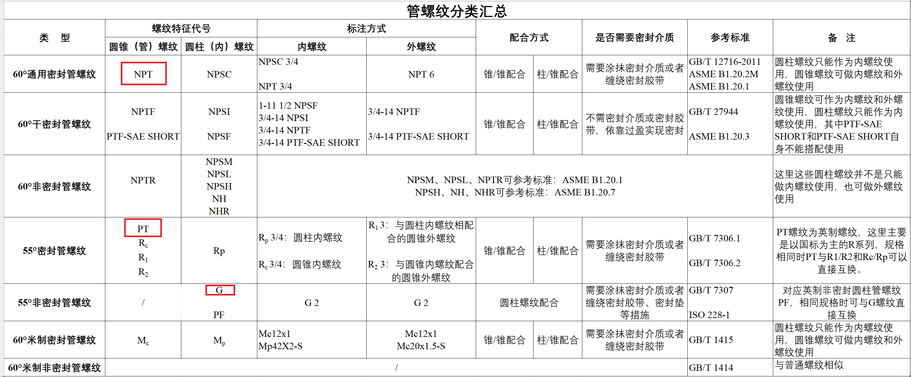
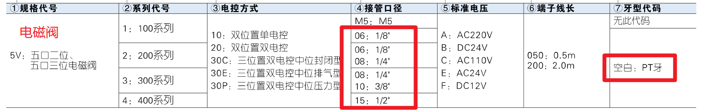
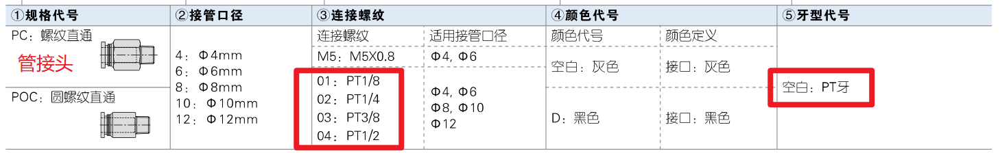
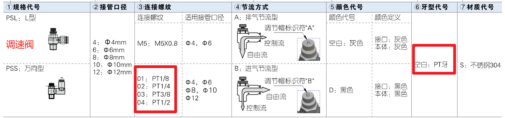
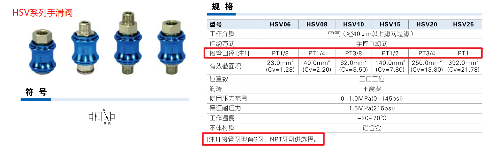
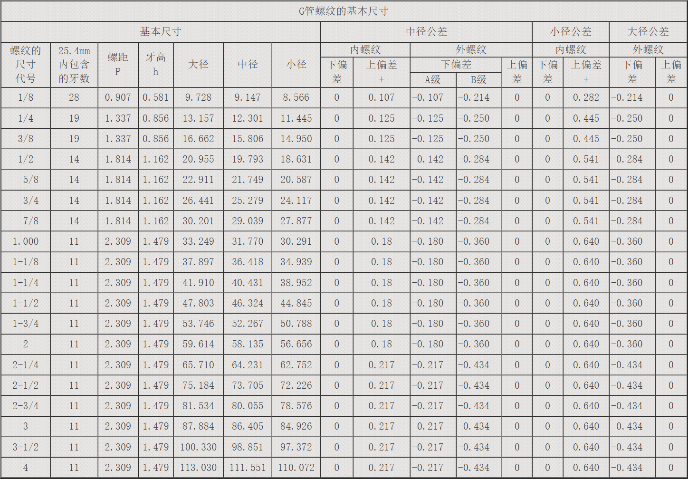

# 管螺纹(PT、G和NPT螺纹)

管螺纹，英语为Pipe Thread，是位于管壁上用于连接的螺纹。管螺纹种类多样，本文仅简介PT、NPT和G螺纹这三种管螺纹，因为这三种螺纹是查看管螺纹尺寸时常看到的几种规格型号。

管螺纹分类汇总(仅供参考，来源：[技术邻](https://www.jishulink.com/post/1975015))：




在寻找管螺纹的资料时，会看到[惠氏螺纹](https://baike.baidu.com/item/%E8%8B%B1%E5%88%B6%E6%83%A0%E6%B0%8F%E8%9E%BA%E7%BA%B9/65002000)这个词，据说是英国人惠特沃斯，在1841年提出的世界上第一份螺纹国家标准，并奠定了螺纹标准的技术体系。PT螺纹和G螺纹就属于惠氏螺纹。后来，美国又研究出了NPT螺纹。这就是常见的三种管螺纹PT、G和NPT。

常见的三种管螺纹PT、G和NPT：

- PT是55度密封圆锥管螺纹
- G是55度非密封圆柱管螺纹
- NPT是美国标准的60度圆锥管螺纹


到目前为止，据本人所知，这三种管螺纹一般用于密封，比如管道连接，气路连接等，可用于防泄露。比如亚德客的电磁阀通气孔螺纹，气管的螺纹接头，调速阀，手滑阀的接管口径等多为PT牙(具体请看手册)。









这三种螺纹尺寸以英寸为单位，螺纹的尺寸代号一般为分数，如1/8、1/4、1/2、3/8等，在不同的螺纹规格中，尺寸标注一般为PT1/8、PT1/4、PT1/2，G1/8、G1/4、G1/2等。

```{note}
- 螺纹中的1/4、1/2、1/8 标记是指管子的通径，单位是英寸。行内人通常用分来称呼螺纹尺寸，一英寸等于8分，1/4 英寸就是2分，3/8英寸就是2分，以此类推。
- 据说M5×0.8的螺纹也有密封的效果。
- G螺纹为55度非密封管螺纹，名称有非密封，但有资料显示，G螺纹常用于输送低压流体等。
```

G螺纹的基本尺寸表(来源：[某网友笔记](https://www.kdr.xyz/a/information/pp/121.html)。一些资料：[NPT圆锥管螺纹的基本尺寸](https://www.164580.com/data/detail_13.html)，[55°非密封管螺纹](https://www.164580.com/data/detail_19.html))



```{note}
我经常听到什么G牙与PT牙还有NPT牙这种牙型是否通用的问题，我好想听过可以安装的言论，具体情况本人不知道，但本人不建议混用。
```

---

一些模型：PISCO|[link](https://www.pisco.co.jp/cn/)，parker|[link](https://www.parker.com/cn/zh/home.html)


