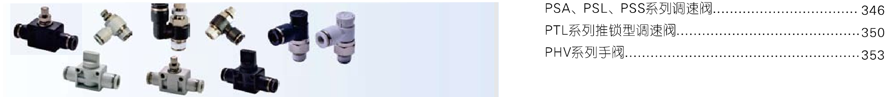
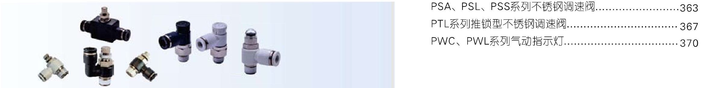
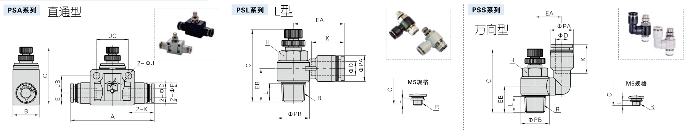
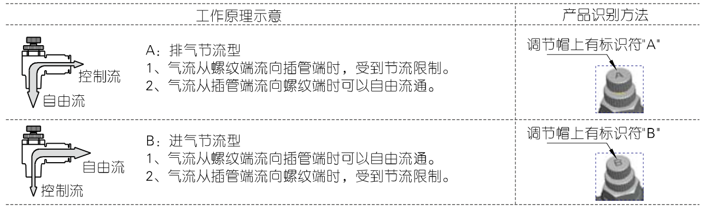
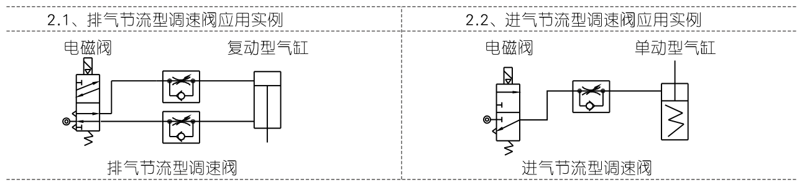
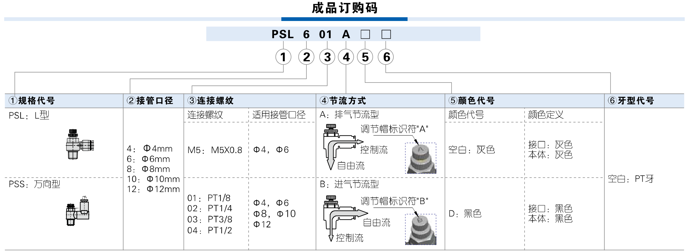
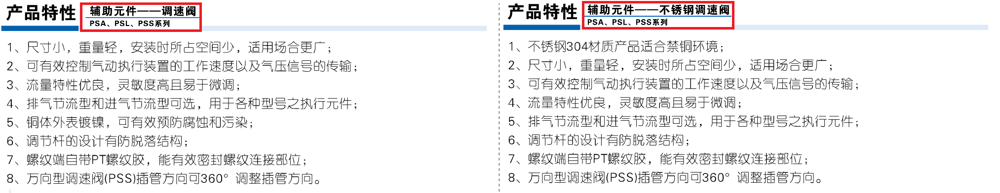

# 亚德客的几种调速阀

经鄙人研究，亚德客手册中，有两种类型的调速阀，**普通型**和**不锈钢型**，如下图所示：





打开亚德客2024A中文简体分册一的电子书第246页，它先介绍了三种不同型号的调速阀，PAS、PSL、PSS调速阀，这三种调速阀的结构如下图所示，如图所示，为它们的结构区别，鄙人见过使用PSL系列较多。



当你相中一款型号之后，还有一个重要参数，**节流方式**。在249页的选型指南显示，调速阀的节流方式有两种，**排气节流型**和**进气节流型**。

- 排气节流型(A)
  - 排气的时候，气体走节流阀；进气的时候，气体走单向阀。即，气体从电磁阀进入气缸，走的是单向阀，畅通无阻；气体从气缸排气的时候，走的是节流阀，可通过它调节气缸速度。
- 进气节流型(B)
  - 进气的时候，气体走节流阀；出气的时候，气体走单向阀。即，气体从电磁阀进入气缸，走的是节流阀，可通过它调节气缸速度；气体从气缸排气的时候，走的是单向阀，气体畅通无阻。



```{note}
根据手册第349页，一般来说，排气节流阀用于双作用气缸，进气节流型用于单作用气缸。
```



```{note}
另外，在手册348页，有关于调速阀的流量特性图，可做选型参照
```

下图为PSL、PSS成品订购码，根据此图，可以看出调速阀的一些参数。连接螺纹参数可根据气缸上的螺纹参数选择，接管口径根据实际可微调，因为同一个连接螺纹大小可能对应多个接管口径。



---

在第350和351页，介绍了一款PTL推锁型调速器，分别为PTL迷你系列和PTL系列，在它们的产品特性介绍栏显示:

- 相比传统型调速阀，尺寸更小，重量更轻，适用场合更广；
- 推锁、解锁控制方便简单；
- ......

经鄙人对比两款接管口径与连接螺纹参数发现，PTL迷你系列款式较少且只有较小的型号，而PTL系列款式较多且比迷你款相对较大。

---

关于不锈钢系列的调速阀，经过鄙人粗略研究，发现不锈钢系列的调速阀在，结构尺寸方面无明显差别，流量特性方面无明显差别，现将两款产品部分参数作简单对比。



